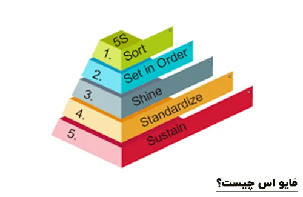

فایو اس (5S) یک روش مدیریت و بهبود کیفیت است که در سازمان‌ها و کارخانه‌ها برای بهبود بهره‌وری، کاهش هدررفت‌ها و بهینه‌سازی فرایندها استفاده می‌شود. فایو اس مخفف عبارات انگلیسی زیر است:

## 1. سورت (Sort): 
در این مرحله، ابزارها، تجهیزات و مواد مورد استفاده در فعالیت‌های مختلف جمع‌آوری و مرتب شده و اقلام غیرضروری حذف می‌شوند. هدف اصلی این مرحله، حذف اشیا غیرضروری و غیراستفاده‌شده و ایجاد فضایی پاک و منظم برای کارکنان است.

## 2. سیستم بندی (Set in Order): 
در این مرحله، ابزارها و تجهیزاتی که در مرحله اول سورت شده‌اند، در مکان‌های مناسب و مرتب قرار می‌گیرند. هدف این مرحله، ایجاد چیدمانی مناسب برای ابزارها و تجهیزات به گونه‌ای که در طول فعالیت‌ها بتوان به راحتی از آن‌ها استفاده کرد.

## 3. تمیز کردن(Shine):
 در این مرحله، محیط کار و ابزارها به طور دوره‌ای و دقیق تمیز شده و از آلودگی‌ها و آثار زباله‌ها و گرد و غبارها پاک‌سازی می‌شود. هدف اصلی این مرحله، ایجاد یک محیط کار تمیز و پاک با افزایش ایمنی و بهبود شرایط کاری است.

## 4. استاندارد (Standardize): 
این مرحله، جهت ایجاد روش هایی به منظور حفظ سه مرحله قبل است. استانداردها، روش‌ها و فرایندها به صورت کتبی و شفاف تعریف و مستند می‌شوند. هدف این مرحله، ایجاد یک سیستم استاندارد و قواعدی برای انجام فعالیت‌ها و بهبود پایدار آن‌ها است.

## 5. پیوسته‌سازی یا انضباط (Sustain):
در این مرحله، تلاش می‌شود تا فرایند‌ها و تغییرات بهبود یافته در مراحل قبلی به صورت پایدار پیگیری شوند. این شامل ارزیابی و بهبود مداوم فرایند‌ها، تعلیم و آموزش کارکنان و تحت نظر قرار دادن سیستم‌ها و استانداردها است. هدف اصلی این مرحله، تضمین کردن استمرار بهبود و بهره‌وری در طول زمان است.

