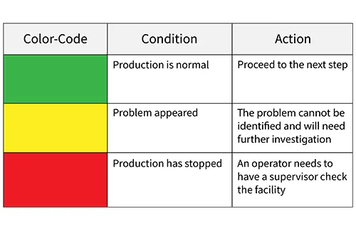

**راهنمای مطالب**
- [تفاوت تولید ناب و انبوه](#تفاوت-تولید-ناب-و-انبوه)
    - [برخی از مهمترین ابزارهای تولید ناب](#برخی-از-مهمترین-ابزارهای-تولید-ناب)
- [آندون (Andon) چیست؟](#آندون-andon-چیست؟)

## تفاوت تولید ناب و انبوه

تولید انبوه (Mass Production) که توسط هنری فورد و با توجه به شرایط بازار خود معرفی شد روشی جهت ساخت و ارائه محصولات در مقیاس بسیار وسیع بود، در حالی که تولید ناب (Lean production) توسط Taiichi Ohno در سالهای پایانی جنگ جهانی دوم مطرح شد بر به حداقل رساندن ضایعات تولید در کنار حفظ کیفیت تولید اشاره داشت.

### برخی از مهمترین ابزارهای تولید ناب

1.  آندون
2.	[فایو اس (5S)](https://www.hooshkar.com/Wiki/Business/5S)
3.	[کانبان](https://www.hooshkar.com/Wiki/Business/WhatIsKanban)
4.	کایزن
5.	تجزیه و تحلیل گلوگاه (Bottleneck Analysis)
6.	اتلاف
7.	شاخص کلیدی عملکرد (KPI)
8.	[زمان تکت (Takt Time)](https://www.hooshkar.com/Wiki/Business/TaktTime)
9.	[تولید به هنگام (Just-In-Time)](https://www.hooshkar.com/Wiki/Production/JustInTime)
10.	و...

## آندون (Andon) چیست؟

عبارت آندون برگرفته از زبان ژاپنی به معنای فانوس است. آندون (هشدار دهنده) یکی از مهمترین ابزارهای مدیریت دیداری است، تابلوهای آندون باید به گونه ای نصب شوند که برای همه به راحتی قابل مشاهده بوده تا همگی مراحل پیشرفت یا نقص موجود در ایستگاه ها را ببینند. در واقع به کمک تابلوهای آندون می توان متوجه شد که کارها در چه مرحله ای قرار دارند.

تابلوی آندون شامل چراغ هایی با رنگ سبز، زرد و قرمز است. بعنوان مثال در خط مونتاژ زمانیکه عملیات بصورت عادی در حال انجام است چراغ ‌های سبز روشن هستند یعنی اینکه تمام عملیات بدون هیچ مشکلی در حال انجام است. 

اگر کارگری به چیزی احتیاج داشته باشد، چراغ زرد و در‌ صورت لزوم با توقف قسمت مربوطه، چراغ قرمز روشن می ‌شود. به هنگام روشن شدن چراغ زرد، سرپرست خط خود را به سرعت به آن ایستگاه کاری می‌ رساند و به همراه اپراتور مربوطه تلاش می ‌کنند تا مشکل را قبل از رسیدن به سایر ایستگاه‌ ها برطرف نمایند اگر مشکل تا آن زمان برطرف ‌نشده باشد، آن بخش متوقف ‌شده و با روشن ‌شدن چراغ قرمز ایستگاه کاری مرتبط، صدای آژیر در تمام کارخانه به صدا در ‌می ‌آید.

زمان نقطه ثابت توقف برای هر ایستگاه از پیش بطور دقیق مشخص می شود و اگر آن ایستگاه، کار خود را در آن تایم به اتمام نرساند، ایستگاه بعدی محصولی برای دریافت و ادامه تولید نخواهد داشت. توقف ایستگاه های کاری توسط سیستم آندون فقط مختص رفع خرابی و نقص ها نیست چرا که به عنوان بخشی از بهبود مستمر، می ‌تواند در جهت کمک به عرضه سرویس با کیفیت باشد.

تکنیک آندون با ایجاد مسئولیت و همچنین استقلال در تصمیم ‌گیری در سلسله مراتب سازمانی، از اپراتور گرفته تا بازرس و سرپرست ‌کیفیت، منجر به رصد ‌کامل فرآیند تولید در ‌سازمان ها می‌ گردد. چرا که این موضوع بسیار مهمی بوده که مانع از رسیدن مشکل و یا قطعه معیوب به ایستگاه‌ های پایانی می ‌شود.

هرچند تولید محصول ناب بسیار زمان بر و هزینه بر است، اما اگر با سیستم آندون پیش برویم می توانید هزینه های توسعه، تغییر و نگهداری بعد از تولید را به حداقل برسانید. 

[تفاوت تولید ناب و انبوه]: #تفاوت-تولید-ناب-و-انبوه
[برخی از مهمترین ابزارهای تولید ناب]: #برخی-از-مهمترین-ابزارهای-تولید-ناب
[آندون (Andon) چیست؟]: #آندون-andon-چیست؟