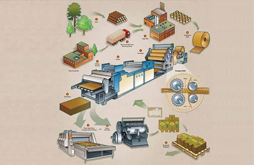

## راه اندازی کارخانه کارتن سازی

راه اندازی یک کارخانه کارتن سازی ممکن است یک فرآیند پیچیده باشد، اما با برنامه‌ریزی دقیق و اجرای صحیح می‌توان به نتیجه‌ی مطلوبی رسید. 

در زیر به چند مرحله کلی برای راه اندازی کارخانه کارتن سازی اشاره خواهیم کرد:

<blockquote style="background-color:#f5f5f5; padding:0.5rem">
مطلب پیشنهادی: <a href="https://www.hooshkar.com/Software/PrintingAndPackaging/Package/Carton" target="_blank"> آشنایی با امکانات نرم افزار کارتن سازی
</a></blockquote>

**1. تحقیقات و بررسی بازار:** قبل از هر چیز، باید بازار محلی و جهانی را برای تقاضای کارتن بررسی کنید. اطمینان حاصل کنید که در منطقه‌ای که قصد راه اندازی کارخانه را دارید، تقاضا برای محصولات کارتن وجود دارد. همچنین، بررسی رقبا و تحلیل صنعت می‌تواند به شما در درک بهتر شرایط و چالش‌های احتمالی کمک کند.

**2. برنامه ریزی مالی:** بررسی هزینه‌های احتمالی برای راه اندازی و عملکرد کارخانه بسیار مهم است. شامل هزینه‌های ساخت و تجهیزات، خرید ماشین آلات، هزینه‌های نیروی کار، هزینه‌های مربوط به انبار و حمل و نقل، هزینه‌های بازاریابی و تبلیغات، هزینه‌های مربوط به مواد اولیه و امکانات می‌شود. همچنین، باید به تأمین مالی کارخانه و منابع مالی برای پشتیبانی از عملیات روزمره توجه کنید.

**3. انتخاب مکان:** انتخاب مکان مناسب برای کارخانه کارتن سازی بسیار اهمیت دارد. باید به عواملی مانند دسترسی به مواد اولیه (نظیر خمیر کاغذ)، نیروی کار، حمل و نقل و بازار دقت کنید. همچنین، باید مطمئن شوید که مکان انتخابی دارای زیرساخت‌های لازم مانند برق، آب و فاضلاب، اینترنت و سایر امکانات است.

**4. تهیه تجهیزات و ماشین‌ آلات:** برای تولید کارتن، نیاز به تجهیزات و ماشین‌آلات خاصی دارید. بررسی بازار برای خرید تجهیزات، انجام مذاکرات با تولیدکنندگان و انتخاب ماشین‌آلاتی که به نیازهای شما پاسخ می‌دهند، ضروری است.

**5. استخدام نیروی کار:** برنامه‌ریزی برای استخدام نیروی کار ماهر و نیمه‌ماهر برای کارخانه بسیار مهم است. بررسی نیازهای نیروی کار، ایجاد فرآیند استخدام و آموزش کارکنان و ارتقای مهارت‌ها برای بهره‌وری بیشتر از کارکنان موجود، از اقداماتی هستند که باید انجام شود.

<blockquote style="background-color:#f5f5f5; padding:0.5rem">
مطلب پیشنهادی: <a href="https://www.hooshkar.com/Software/PrintingAndPackaging" target="_blank"> آشنایی با امکانات نرم افزار صنایع چاپ و بسته بندی
</a></blockquote>

**6. <a href="https://www.hooshkar.com/Software/Fennec/Module/ProductionPlanning" target="_blank">برنامه ریزی تولید</a> و کنترل کیفیت:** برنامه ریزی صحیح تولید، از تأمین مواد اولیه تا تولید و بسته‌بندی محصولات نهایی، اساس موفقیت کارخانه کارتن سازی است. همچنین، ایجاد سیستم کنترل کیفیت برای اطمینان از کیفیت بالای محصولات و پاسخ به نیازهای مشتریان بسیار مهم است.

**7. بازاریابی و فروش:** برنامه ریزی برای بازاریابی و فروش محصولات نیز باید در نظر گرفته شود. برنامه ریزی برای جذب مشتریان، ارتباط با تامین کنندگان و مشتریان، تبلیغات و بازاریابی موثر می‌تواند در رشد کسب و کار شما کمک کند.

**8. رعایت قوانین و مقررات:** بررسی و رعایت قوانین و مقررات مربوط به <a href="https://www.hooshkar.com/Wiki/Business/CartonIndustry" target="_blank">صنعت کارتن سازی</a> و بسته‌بندی بسیار اهمیت دارد. اطمینان حاصل کنید که به تمام قوانین محلی و بین‌المللی مربوط به بهداشت و ایمنی کارکنان، حمل و نقل محصولات و سایر موارد احترام بگذارید.

**9. ارتباط با تامین کنندگان:** ایجاد روابط قوی با تامین کنندگان خمیر کاغذ و سایر مواد اولیه مورد نیاز برای تولید کارتن بسیار اساسی است. اطمینان حاصل کنید که تامین کنندگان قادر به تأمین مواد با کیفیت و به موقع هستند.

**10. مدیریت عملیات:** یک سیستم مدیریت کارآمد و موثر برای کنترل و نظارت بر عملیات روزانه کارخانه لازم است. باید روال‌های تولید، مدیریت انبار، <a href="https://www.hooshkar.com/Software/Fennec/Module/ProductionPlanning" target="_blank">برنامه ریزی تولید</a> و سایر فعالیت‌های مربوط به عملیات را به صورت دقیق در جهت دستیابی به بهره‌وری بالا طراحی کنید.

**11. پیشرفت تکنولوژی:** صنعت کارتن سازی با پیشرفت تکنولوژی همراه است. رصد و استفاده از آخرین دستاوردهای تکنولوژیک در فرآیندها و ماشین‌آلات می‌تواند کیفیت تولید را بهبود بخشد و به شما کمک کند که با رقبا رقابت کنید.

**12. بازبینی و بهبود مستمر:** همواره باید فرآیندها و عملکرد کارخانه را مورد بازبینی قرار داده و بهبودهای لازم را اعمال کنید. مطمئن شوید که از بازخورد مشتریان و کارکنان استفاده کرده و به مشکلات و نیازهای آن‌ها پاسخ دهید.

همچنین، در نظر داشته باشید که راه اندازی کارخانه کارتن سازی نیاز به صبر، قدرت اجرایی و برنامه ریزی دقیق دارد. بهتر است که قبل از شروع به کار، با متخصصان و کارشناسان مربوطه مشورت کنید و از تجربیات آن‌ها بهره‌برداری کنید. علاوه بر این، در نظر داشته باشید که موفقیت در این صنعت نیازمند رقابت قوی، نوآوری و توانایی سازگاری با تغییرات بازار است.

<blockquote style="background-color:#f5f5f5; padding:0.5rem">
مطلب پیشنهادی: <a href="https://www.hooshkar.com/Software/PrintingAndPackaging/Package/Box" target="_blank"> آشنایی با امکانات نرم افزار جعبه سازی
</a></blockquote>
