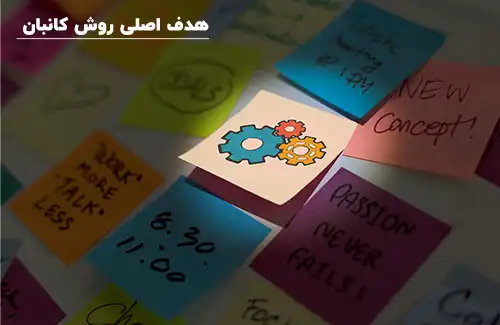

<blockquote style="background-color:#eeeefc; padding:0.5rem">
آنچه در این مطلب خواهید خواند:

- [تعریف کانبان](#تعریف-کانبان)
- [تخته کانبان چیست](#تخته-کانبان-چیست)
- [اصطلاحات اساسی کانبان](#اصطلاحات-اساسی-کانبان)
- [هدف اصلی روش کانبان چیست؟](#هدف-اصلی-روش-کانبان-چیست؟)
- [چگونه برنامه ریزی تولید با استفاده از روش کانبان انجام می‌شود](#چگونه-برنامه-ریزی-تولید-با-استفاده-از-روش-کانبان-انجام-می‌شود)
- [روش های مختلف برنامه ریزی تولید با استفاده از کانبان](#روش-های-مختلف-برنامه-ریزی-تولید-با-استفاده-از-کانبان)
    - [کانبان کارتی](#کانبان-کارتی)
    - [صندوق کانبان](#صندوق-کانبان)
    - [کار پیوسته در جریان (Constant Flow of Work) یا CFW](#کار-پیوسته-در-جریان-constant-flow-of-work-یا-cfw)
- [مزایای روش استفاده از کانبان](#مزایای-روش-استفاده-از-کانبان)
- [معایب کانبان](#معایب-کانبان)
- [چرا باید از کانبان استفاده کنیم؟](#چرا-باید-از-کانبان-استفاده-کنیم؟)

</blockquote>

**مقدمه**

مدیریت تولید و عملیات یکی از مهمترین چالش‌های پیش روی شرکت‌ها در دنیای امروز است. شرکت‌ها به دنبال راه‌هایی هستند تا بتوانند تولید را بهینه‌تر کنند، هزینه‌ها را کاهش دهند، سودآوری را افزایش دهند و در عین حال کیفیت محصولات و رضایت مشتریان را حفظ نمایند.
در این مقاله، ابتدا خاستگاه روش کانبان و چگونگی شکل‌گیری آن را مرور می‌کنیم. سپس به بررسی مفهوم کانبان و اجزای اصلی آن می‌پردازیم و مراحل اجرای این روش را توضیح می‌دهیم.

<blockquote style="background-color:#f5f5f5; padding:0.5rem">

<strong>آشنایی با <a href="https://www.hooshkar.com/Software/Sayan/Package/Industrial" target="_blank">نرم افزار کانبان</a> (داشبورد مدیریتی) 
</strong></blockquote>

## تعریف کانبان

کانبان عبارتی ژاپنی به معنای (نشانه بصری) یا (کارت) است. که نخستین بار توسط تویوتا وارد فضای مدیریت شد. در واقع کانبان شبیه Board عمومی یا تابلویی است که برای همه قابل مشاهده است. 

نگرش رایج قبل از کانبان برای مدیریت خط تولید، سیستمی به نام تزریق یا Push  بود؛ که بزرگترین مشکل این سیستم تولید مازاد و خواب سرمایه بود، از طرفی اگر تقاضای جدیدی از سمت مشتریان در این سیستم دریافت می‌شد بخاطر کمبود مواد اولیه و یا ترافیک گلوگاه‌های تولیدی، آن سفارش قابل عرضه نبود.

سیستم کانبان از روش عرضه کالاهای سوپر مارکتها الگو برداری شده است بدین صورت که سوپر مارکت‌ها موظفند زنجیره تامین را با تقاضای مشتری هماهنگ نمایند و این مشتری‌ها نیستند که باید نگران خالی شدن قفسه‌ها باشند.

کانبان نشان می‌‌دهد چه محصولی، در چه زمانی و به چه مقدار باید تولید شود. کانبان یک سیستم ساده گردش مواد و اطلاعات است که برای حرکت مواد از یک ایستگاه کاری به سمت ایستگاه کاری دیگر مورد استفاده قرار می‌گیرد.

سیستم کانبان در واقع یک کارت اطلاعاتی است که برای برنامه‌ریزی، پیشبرد فرآیند و زمان ‌بندی عملیات تولید به کار می‌رود. هر چقدر سرعت و دقت در خط تولید یک مجموعه دارای اهمیت بیشتری باشد، جهت تکمیل ابزار کانبان بایستی هزینه بیشتری پرداخت گردد.

## تخته کانبان چیست

تخته کانبان روش اجرای کانبان می‌باشد که می‌تواند بصورت تخته فیزیکی و یا آنلاین بر روی نرم افزارهای مدیریت پروزه پیاده سازی گردد. ساده ترین نوع آن از سه ستون تشکیل شده است:

* ستون To Do (انجام دادن): فعالیتی که هنوز آغاز نشده در این ستون قرار می‌گیرد.
* ستون In Progress (در حال پیشرفت)
* ستون Done (انجام شده)

## اصطلاحات اساسی کانبان

برای استفاده بهینه از کانبان، آشنایی با جزییات و اصطلاحات اساسی آن ضروری است.
در ادامه، برخی از اصطلاحات اساسی این روش را به طور مختصر مورد بررسی قرار می‌دهیم.

**-	برد کانبان:** برد کانبان یکی از اجزای اساسی روش کانبان است و نقش مهمی در تصویرسازی تمامی امور باقی‌مانده و انجام شده را ایفا می‌کند. 

این برد باید به حداقل سه بخش مختلف تقسیم شود: کارهای درخواستی، کارهای در جریان و کارهای انجام شده که هرکدام مراحل مختلف فرآیند را نمایان می‌کنند.

**-	کارت کانبان:** کارت‌های کانبان وظایف و کارهای متعددی را که در سرتاسر برد کانبان حرکت می‌کنند، نمایان می‌کنند. این کارت‌ها حاوی اطلاعات مختلفی مانند توضیحات، تاریخ تحویل، ابعاد و دیگر جزئیات مربوط به وظیفه مربوطه هستند.

**-	ستون ها:** ستون‌ها برد کانبان را به صورت عمودی تقسیم می‌کنند و هر یک نمایانگر یک مرحله جداگانه در جریان کاری شما هستند. 

هر برد کانبان از سه ستون اصلی تشکیل شده است: کارهای درخواستی، کارهای در حال انجام و کارهای انجام شده. با توجه به پیچیدگی فرآیند کار، این مراحل ممکن است شامل ستون‌های کوچک‌تر نیز شوند.

**-	خطوط مسئولیت:** این خطوط افقی هستند که برد را به بخش‌های مختلف تقسیم می‌کنند. تیم‌ها از این خطوط مسئولیت، برای جداسازی انواع کارها از یکدیگر به صورت بصری استفاده می‌کنند، به این ترتیب وظایف را دسته‌بندی می‌کنند.

**-	زمان چرخه:** چرخه زمان، درست زمانی آغاز می‌گردد که یک وظیفه جدید وارد مرحله "در جریان" می‌شود و یک یا چند نفر به آن مشغول می‌شوند.

<blockquote style="background-color:#f5f5f5; padding:0.5rem">

<strong>بیشتر بخوانید: <a href="https://www.hooshkar.com/Wiki/Business/KanbanVsScrum" target="_blank">تفاوت کانبان و اسکرام چیست؟</a>
</strong>
</blockquote>

### هدف اصلی روش کانبان چیست؟

شما باید دقیقاً آنچه که مشتری نیاز دارد را تولید کنید، نه بیشتر و نه کمتر.

همانطور که گفتیم کانبان مجموعه‌ای از علامت‌هاست که در جریان تولید مورد 
استفاده قرار می‌گیرد. در این روش، جریان ساخت و تولید از سمت تقاضای مشتری به تولید هدایت می‌شود، نه از تولید به سمت مشتری عملاً، این روش پس از دریافت سفارش از مشتری، شروع به برنامه‌ریزی می‌کند. 

در مرحله اول، حجم و نوع سفارش از سوی مشتری مشخص می‌شود، سپس مواد اولیه و دیگر فرایندهای مورد نیاز و در نهایت به تولید ختم می‌شود.

برای اجرای روش کانبان، محدودیتی به جز خلاقیت مدیران و سرپرستان وجود ندارد.

سیستم کانبان سازمان شما می‌تواند از کارت یا نرم‌افزار استفاده کند. این بدین معناست که هیچ محدودیتی در اجرا وجود ندارد، اصول کانبان همیشه ثابت است.

برای استفاده از روش‌های نرم‌افزاری کانبان در مدیریت زنجیره تأمین و تولید، تولید‌کنندگان نرم‌افزار به سرعت به توسعه سیستم‌های دیجیتالی کانبان (E-Kanban) پرداختند. این نرم‌افزارها به شما امکان می‌دهند تا جریان تولید را جز به جز در آن‌ها تعریف و پیاده‌سازی کنید.

بیشتر این نرم‌افزارها امروزه با سیستم‌های نرم‌افزاری جامع‌تری مانند ERPها یا راهکارهای سازمانی مشابه، یکپارچه شده‌اند.

### چگونه برنامه ریزی تولید با استفاده از روش کانبان انجام می‌شود

همانطور که پیشتر گفتیم تخته کانبان، ستون‌های مختلفی دارد که هر کدام بخش خاصی از پروژه را پیگیری می‌کنند.

 در حوزه تولید، هر کارت معمولاً یک سفارش است که باید تکمیل شود. زمانی که مشتریان سفارش جدیدی ثبت می‌کنند، وظایف اجرایی به ستون در حال انجام می‌روند و معمولاً نام مسئول هم همراه با آن آمده است.
 
 توضیحات و مستندات پیشرفت هر مرحله به کارت‌های پروژه اضافه می‌شود، که این امر برای کسب‌وکارهایی که از روش‌های نرم‌افزاری استفاده می‌کنند، راحت‌تر است.
 
 در آخرین مرحله و بعد از تکمیل پروژه، تمام مستندات بایگانی می‌شوند و کارت پروژه به ستون پایان یافته‌ها منتقل می‌شود.

## روش های مختلف برنامه ریزی تولید با استفاده از کانبان

### کانبان کارتی

در این روش برنامه‌ریزی، چند کارت ساده را بر روی یک تکه کاغذ چسبانده و آن‌ها را بر روی یک تخته یا هر مکان دیگری قرار می‌دهیم.

هر کارت زیر یک ستون فرایند مشخص قرار می‌گیرد، به عنوان مثال اگر سه ستون با عناوین "سفارش‌های دریافت‌شده"، "در حال انجام" و "تمام‌شده‌ها" داشته باشیم، هر کارت زیر هر ستون مربوطه قرار می‌گیرد.

روی این کارت‌ها جزئیاتی مانند حجم سفارش، تاریخ سفارش، تاریخ تحویل، ویژگی‌های خاص و سرپرست تولید آن نوشته می‌شود.

تعداد کارت‌های هم‌زمان روی تخته نباید بیش از پنج تا باشد.

### صندوق کانبان

صندوق کانبان کاملاً شبیه به کانبان کارتی است، با این تفاوت که در این روش، کارت‌ها درون صندوق‌هایی قرار می‌گیرند که هرکدام یک بخش از پروژه را تشکیل می‌دهند.

به عبارت دیگر، ستون‌های کانبان کارتی در اینجا به صندوق‌ها تبدیل شده‌اند. این روش می‌تواند با دو صندوق، سه صندوق یا هر تعداد صندوقی که نیاز دارید، پیاده‌سازی شود، با توجه به شرایط کسب‌وکار شما.

<blockquote style="background-color:#f5f5f5; padding:0.5rem">

<strong>بیشتر بخوانید: <a href="https://www.hooshkar.com/Wiki/Business/WhatIsScrum" target="_blank">اسکرام چیست؟</a>
</strong>
</blockquote>

### کار پیوسته در جریان (Constant Flow of Work) یا CFW

این ایده بیشتر به مدیریت قفسه‌های فروشگاهی شباهت دارد.

در این روش، هنگامی که فرآیندهای تولید محصول در یک ایستگاه کاری کامل می‌شود و محصول به ایستگاه بعدی منتقل می‌شود، یک جای خالی در ایستگاه‌های کاری به وجود می‌آید، که به آن "کانبان" می‌گویند.

 تمام فرآیندها باید برای پر کردن این جای خالی آماده باشند. این روش برای کسب‌وکارهایی که تنها یک یا دو محصول دارند و دارای نوسان تولید کمی هستند، مناسب است.
 
 البته برخی اعتقاد دارند که این روش برای تولید‌کنندگانی که حجم بالایی دارند و دارای نوسانات زیادی هستند، مناسب است، با شرط این‌که از روش ساخت برای سفارش استفاده کنند.

## مزایای روش استفاده از کانبان

روش کانبان به دلیل تصویری بودن موجب بهبود گردش کار و کاهش زمان چرخه می‌شود. اما از دیگر مزایای این روش می‌توان موارد زیر را نام برد:

1.	روشی شناور: روشی شناور و منعطف که با وارد شدن Task جدیدی می‌توانید اولویت‌ها را مجددا ارزیابی نمایید.
2.	ساده: به دلیل تصویری بودن، به راحتی قابل درک است.
3.	کاهش اتلاف منابع زمانی و مالی
4.	جریان تحویل محصولات و خدمات به مشتری را نظم و بهبود می‌‌بخشد
5.	افزایش سرعت و دقت در فرایند کار به جهت کاهش زمان چرخه

## معایب کانبان

معایبی که برای کانبان بیان می‌شود به دلیل پیاده سازی و مدیریت اشتباه و یا عدم بروزرسانی تخته کانبان می‌باشد.

اما مشکل اصلی مشخص نبودن زمان اجرای فعالیت‌هاست، چراکه ستون‌های در نظر گرفته شده بر اساس فاز فرایندها در نظر گرفته شده که نمی‌توانید بفهمید مثلا فاز To Do چقد زمان جهت اجرا و اتمام نیاز دارد تا فازهای بعدی را برنامه ریزی نمایید.

## چرا باید از کانبان استفاده کنیم؟

کانبان به منظور صرفه‌جویی در زمان، هزینه و منابع شرکت‌ها فعالیت می‌کند. هدف آن از پیش‌بینی گلوگاه‌ها و جلوگیری از وقوع آنها و همچنین ارتقاء بهره‌وری و انعطاف‌پذیری است.

---

می‌خواهید از مزایای کانبان در سازمان خود بهره‌مند شوید؟ برای دریافت مشاوره، با کارشناسان <a href="https://www.hooshkar.com" target="_blank">هوشکار</a> در ارتباط باشید.

[مقدمه]: #مقدمه
[تخته کانبان چیست؟]: #تخته-کانبان-چیست؟
[مزایای روش استفاده از کانبان]: #مزایای-روش-استفاده-از-کانبان
[معایب کانبان]: #معایب-کانبان