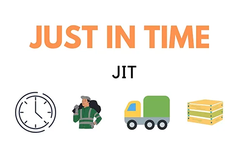
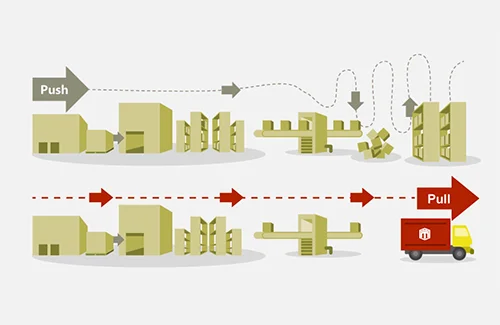
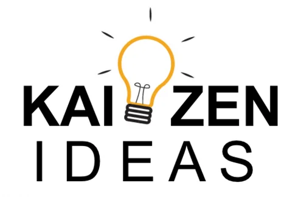
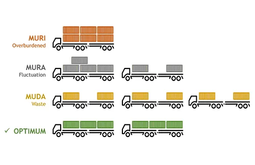

**راهنمای مطالب**
- [مقدمه](#مقدمه)
- [سیستم برنامه ریزی و کنترل تولید فشاری Push SYS](#سیستم-برنامه-ریزی-و-کنترل-تولید-فشاری-push-sys)
- [سیستم برنامه ریزی و کنترل تولید کششی Pull SYS](#سیستم-برنامه-ریزی-و-کنترل-تولید-کششی-pull-sys)
    - [تفاوت سیستم برنامه ریزی و کنترل تولید فشاری و کششی](#تفاوت-سیستم-برنامه-ریزی-و-کنترل-تولید-فشاری-و-کششی)
    - [مزایا و معایب سیستم تولید فشاری](#مزایا-و-معایب-سیستم-تولید-فشاری)
    - [مزایا و معایب سیستم تولید کششی](#مزایا-و-معایب-سیستم-تولید-کششی)
- [اصول تولید به هنگام](#اصول-تولید-به-هنگام)
- [کایزن (Kaizen): بهبود مستمر و ترویجی](#کایزن-kaizen-بهبود-مستمر-و-ترویجی)
- [از بین بردن تلفات (MUDA, MURI, MURA)](#از-بین-بردن-تلفات-muda-muri-mura)
- [سایر اصول به هنگام](#سایر-اصول-به-هنگام)
- [کارت کانبان (Kanban)](#کارت-کانبان-kanban)
- [تابلو آندون (Andon)](#تابلو-آندون-andon)
- [زمان تکت (Takt Time)](#زمان-تکت-takt-time)

## مقدمه
سیستم تولید Just in time در ایران بسیار محدود است. بخاطر برآورد کردن تقاضای احتمالی، در دسترس نبودن تامین کننده قطعی و نوسان نرخ ارز.

## سیستم برنامه ریزی و کنترل تولید فشاری Push SYS

تا اینجا با MRP آشنا شدید، در این مقاله MRP1 (Material Requirement Planning) را شرح دادیم و MRP2 (Money Requirement Planning) یکسری برنامه ریزی های تامین مالی و پولی می باشد. علاوه بر اینکه برآورد و برنامه ای را ایجاد می کند جهت تولیدات مختلف، روند تولید و برنامه ریزی پولی و مالی نیز کاربرد دارد. 

یکسری تحلیل های Decision Support System را در اختیار ما قرار می دهد تا به بهترین تامین کننده جهت متریال مدنظر دسترسی داشته باشیم. 

یکسری تصمیم گیری های مدیریتی هم بصورت راهنمایی در اختیار ما قرار می دهد که در این دوره به آن ورود نمی کنیم چرا که بحث سیستم های مدیریت اطلاعات را شامل می شود. 

*	این سیستم دقیقا سیستم تولید MRP است. برنامه ریزی تولید بر مبنای داده هایی نظیر تقاضاهای پیش بینی شده، لیست مواد (Bill of Material)، زمان تدارک (Lead Time) و وضعیت موجودی صورت می گیرد.
*	در این سیستم بعد از تهیه یک سربرنامه تولید برای محصولات نهایی و قابل تحویل به مشتری، برنامه براساس ساختار BOM شکسته شده و تبدیل به برنامه تولید قطعات ساختنی و برنامه خرید سایر مواد و قطعات می شود.
*	سپس براساس برنامه های ساخت قطعات، مواد اولیه مورد نیاز به ترتیب از ایستگاه اول به سمت ایستگاه آخر جریان یافته تا تبدیل به محصولات مورد نظر شوند. 
*	در این سیستم ایستگاه های بالاتر قطعات مورد نیاز را برای ایستگاه های بعدی فراهم می سازند.

## سیستم برنامه ریزی و کنترل تولید کششی Pull SYS

*	این سیستم برخلاف سیستم فشاری از تقاضای پیش بینی شده برای کنترل تولید استفاده نمی کند. این سیستم بر اساس تقاضای واقعی از مواد، قطعات یا محصولات نهایی برنامه ریزی می شود.
*	وقتی سفارش از طرف مشتری وارد سیستم می شود، این سفارش به ایستگاه آخر که معمولا مونتاژ است می رود. این ایستگاه قطعات مورد نیاز خود را از ایستگاه ماقبل گرفته و این روال تا ایستگاه اول ادامه می یابد.
*	به همین دلیل از سیستم تولید کششی تحت عنوان سیستم Just in time (JIT) یاد می شود. پس روند کار با سیستم تولید 

### تفاوت سیستم برنامه ریزی و کنترل تولید فشاری و کششی
*	در سیستم های فشاری، تولید با تمام توان و ظرفیت صورت می گیرد ولی در سیستم کششی تنها وقتی که مشتری تقاضا می کند و دقیقا به همان میزان انجام می گیرد.
*	در سیستم فشاری یک کار وقتی اجازه ورود به خط تولید را دارد که به وسیله یک زمان بندی از پیش تعیین شده خوانده شود ولی در سیستم کششی یک کار وقتی اجازه ورود به خط دارد که علامت به وسیله وضعیت خط ایجاد شود.
*	سیستم فشاری در انطباق سریع با تغییراتی که در سیستم ایجاد می شود توانایی پاسخگویی سریع به تغییرات را ندارد و با مشکل مواجه می شود. (این تغییرات یا ناشی از نوسانات تقاضا می تواند باشد یا مشکلاتی که در برخی فرایندها صورت می گیرد.)
*	لذا برای انطباق با این تغییرات، خط تولید باید برنامه تولید را برای تمامی مراحل تولید به طور همزمان تغییر دهد که این امر بسیار مشکل است و این موضوع منجر به ایجاد موجودی غیر ضرروی و نیز تجهیزات و کارگران اضافی می شود.

### مزایا و معایب سیستم تولید فشاری

1.	**مزایا:**
* به مدیران اجازه داده می شود تا مدیریت کنند (برنامه ریزی و کنترل)
* دانش بالایی در رابطه با زمان های تولید و جریان مواد نیاز است.
* می تواند به مقادیر بهینه در خرید و تولید بیانجامد.
* اجازه می دهد که مونتاژهای بزرگ و پیچیده برنامه ریزی شوند. چون که زیر مونتاژها و قطعات مورد نیاز تنها براساس نیاز به بخش تولیدی مربوطه می رسند.

2.	**معایب:**
* می تواند منجر به ایجاد مقادیر زیادی از موجودی شود.
* می تواند موجب ایجاد مقادیر زیادی از خرابی شود، قبل از آنکه منشا خرابی آشکار شود.
* جریان مواد موثری باید برقرار باشد.
* نیاز به داده ها و بانک های اطلاعاتی گسترده و بزرگ دارد.

### مزایا و معایب سیستم تولید کششی

1.	**مزایا:**
* مقادیر مشخص و دانسته از موجودی در دست محصولات پایانی
* کارگران تنها وقت و مواد اولیه را بر آنچه واقعا مورد نیاز است متمرکز می کنند.
* کیفیت باید در سطح بالایی باشد، هر قطعه ای باید درست و صحیح به جایی که تعلق دارد ارسال شود وگرنه بازخورد خرابی داده می شود.

2.	**معایب:**
* هرکاری ممکن است تبدیل به یک سفارش پر استرس شود.
* سیستم تولیدی باید کاملا متعادل باشد.
* زمان های راه اندازی به شدت بر مقدار محصول خروجی تاثیر می گذارند.
* هر مشکلی می تواند به نارضایتی مشتری (چه داخلی و چه خارجی) تبدیل شود.

برنامه ریزی تولید ترکیبی است از دروس مهندسی صنایع همچون مدیریت استراتژیک، طرح ریزی واحد های صنعتی، ارزیابی کار و زمان، زمان سنجی، مباحث اقتصاد، حسابداری و موجودی ها (شامل موجودی 1 و موجودی 2). 

## اصول تولید به هنگام
سیستم تولید به هنگام یکی از پیشرفته ترین سیستم های تولید و برنامه ریزی است که در صدر هرم سیستم های نوین برنامه ریزی و کنترل تولید قرار گرفته است.
امروزه به لحاظ محدودیت های اقتصادی مختلفی که بر سر راه مدیران قرار گرفته و توسعه و پیچیدگی بازارها، استفاده بهینه از منابع در دسترس، شناخت و پاسخگویی به نیازها و خواسته های مشتریان در بخش های مختلف بازار به امری اجتناب ناپذیر تبدیل شده که در واقع اشاره می کند که بایستی سیستم را به سمت تولید به هنگام (Just in time) پیش ببریم.

## کایزن (Kaizen): بهبود مستمر و ترویجی
برای ایجاد یک سازمان بهره ور نیاز نیست تغییرات انفجاری را ایجاد کنیم بلکه هر بهبود و هر اصلاحی به شرط اینکه مداوم و پیوسته باشد بر اساس اصل کایزن باعث ارتقای بهره وری در سازمان می شود. یکی از اصول تولید به هنگام همین کایزن می باشد.  
این سیستم تولیدی در آغاز (اوایل دهه 1960) توسظ کارخانه های خودروسازی تویوتا در ژاپن به وجود آمد. تائی چی اوهنو کسی بود که برای نخستین بار این شیوه تولیدی را به جهان غرب معرفی نمود.
بر این اساس سیستم تولیدی اقلام مورد نیاز را با کیفیت مورد نیاز، به مقدار مورد نیاز و دقیقا در زمان مورد نیاز تولید کند. دقیقا همان سیستم کششی هست. 

## از بین بردن تلفات (MUDA, MURI, MURA)

**1. مودا**

مودا یعنی اتلاف (Waste) و به آن دسته از فعالیت ها گفته می شود که جاذب و مصرف کننده منابع و ذخایر است ولی با این حال هیچ ارزشی نمی آفریند. موداها انواع بسیاری دارند که هر سازمان با توجه به فعالیتها و شناخت منابع خود باید آنها را شناسایی کرده و سعی در از بین بردن و حذف آنها داشته باشد. در هر کسب و کاری ما می توانیم تلفات را با تعریف های مختلفی بیان نماییم. از دید مشتری، تولید کننده، استادیوم ورزشی، توزیع کننده و یا از دید واحدی که فقط براساس خرید و فروش موجودی کار می کند، به همین دلیل است که می گویند در کایزن حتما بایستی یک تیم تشکیل بدهیم، تیمی که در امر شناسایی تلفات خبره باشد.
اما از دید مشتری مودا چیست؟ موداها فعالیتهایی هستند که از دید مشتری بی ارزش بوده و مشتری تمایلی ندارد بابت آنها هزینه ای پرداخت نماید.
به عنوان مثال مشتری تمایلی ندارد بابت حمل و نقل مواد به کارخانه هزینه پرداخت نماید. حتی کالاهایی که بصورت معیوب تولید می شود مثل ضایعات. 
مثال مودا در تولید: موارد زیادی وجود دارد که هر کدام طبقه بندی های خاص خودشان را دارند. مثل بایگانی های غیر ضروری، موجودی های اضافی، توقف کارکنان در صف سلف غذا، انتظار و تاخیر، تولید مازاد، کار اضافی، جابجایی های غیر ضرروی وسایل حمل و نقل و حتی نیروی انسانی  

**2. موری**

موری چیست؟ همه ما می دانیم وقتی که افراد استخدام می شوند معمولا به دلیل اینکه آموزش های ناکافی و نادرست می بینند رویه های کاری درستی برایشان تعریف و مشخص نمی شود این باعث می شود که شخصی که استخدام شده با سعی و خطا آموزش ببیند و این در واقع یک موری است. موری به معنای بی دلیل یا بی پایه می باشد. اتلاف های مربوط به سختی انجام کار را موری می گویند. 
مثال: ابزارهای مورد نیاز برای اپراتور خط تولید ناکافی باشند، فشار بیش از حد به ماشین و نیروی انسانی خودش یک موری است. انجام دسته ای از کارهایی که توسط ماشین یا بصورت اتوماتیک می تواند انجام شود پس می توانیم بگوییم موری به نوعی تمامی کارهایی که وقت گیر هستند، می توانند موری تلقی شوند. 

**3. مورا**

مورا به معنای غیر طبیعی یا نابرابری است. این لغت به معنی مخالف معمولی یا طبیعی می باشد. مورا همچنین می تواند به حرکت، عمل یا روش فکری غیر طبیعی برگردد. مثال: کارخانه نوشابه: کم بودن نوشابه از یک سطحی در بطری باعث نارضایتی مشتری می شود و یا بالعکس باعث افزایش هزینه های تولید و یا حتی افزایش استهلاک ماشین آلات و ضایعات تولیدی شود. پس مورا به اتلاف هایی گفته می شوند که ناشی از نوسانات تولید باشند.

 *	تلفات حرکت غیرموثر
 *	تلفات فرایند
 *	تلفات موجودی
 *	تلفات حمل و نقل
 *	تلفات ناشی از محصول خراب
 *	تلفات زمان انتظار
 *	تلفات اضافه تولید

**صفر کردن عیوب:**
در دیدگاه متداول، معمولا درصد قابل توجهی از خرابی ها به عنوان سطح کیفی قابل قبول (AQL) در مراکز کنترل کیفیت در نظر گرفته می شود.
در سیستم تولید به هنگام برای آنکه اهداف تولیدی قابل دسترس باشند. باید تمام منشاهای ایجاد عیوب از میان برداشته شود.

**صفر کردن آماده سازی:**
معمولا اندازه انباشته تولید (دسته تولیدی) از تعادل بین هزینه های نگهداری و هزینه های راه اندازی بدست می آید. در سیستم تولید به هنگام، مفاهیم زمان آماده سازی صفر و اندازه انباشته، اعدادی باهم مرتبط هستند.  
اگر هزینه راه اندازی صفر شود اندازه دسته اقتصادی تولید یا اندازه انباشته تولید عددی بهینه خواهد شد که در واقع ما سوق پیدا می کنیم به صفر نمودن آماده سازی که یکی از اصول سیستم Just in time است.

**کاهش موجودی ها:**
در سیستم تولید کششی سطح موجودی ها کاهش پیدا می کند. کاهش موجودی ها مثل یک اقیانوسی است که زیر این اقیانوس کوه ها بعنوان یک موانعی هستند که بر سر راه تولید قرار دارند. اگر این سطح موجودی ها یا در واقع سطح آب اقیانوس کاهش پیدا کند این کوه ها و صخره ها از سطح آب دریا بالا می آیند که در واقع نشان دهنده اینست که می توانیم موانع و مشکلاتی که بر سر راه تولید است را ببینیم.
این موجودی ها باعث می شود که نتوانیم بهترین تامین کننده، بهترین مشتری، بهترین عرضه کننده را شناسایی نماییم یا اینکه در کدام بخش از تولید مشکل وجود دارد که نمی توانیم تقاضای خودمان را با بهترین زمان مدنظر پوشش دهیم. پس کاهش موجودی ها در واقع یک فشاری است که بر تولید کننده اعمال می شود تا بتواند موانع و مشکلات بر سر راه تولید خودش را شناسایی کند.

## سایر اصول به هنگام
*	کیفیت بالا برای مواد اولیه و کالاهای ساخته شده
*	سیستم اثربخش نگهداری تجهیزات
*	تنوع مهارت های کارکنان و انعطاف تجهیزات
*	توسعه نیروی کار با قابلیت های انعطاف
*	خرید یا تولید به مقدار نسبتا کم

## کارت کانبان (Kanban)

*	تولید به هنگام به طور مستقیم از کارتهای کانبان استفاده می کند.
*	کانبان به نوعی کارتهای کنترل موجودی گفته می شود که در آن تکامل فرایند تولید نمایش داده می شود.
*	سیستم کانبان نوعی از نظام اطلاع رسانی دستی است.
*	کانبان بیشتر به صورت یک برگه مستطیل شکل است که معمولا پوششی از پلاستیک شفاف آن را در برگرفته است و حاوی مطالب زیر است:
    *	اطلاعات مربوط به تحویل قطعات
    *	اطلاعات مربوط به حمل و نقل قطعات
    *	اطلاعات مربوط به تولید قطعات
*	این ایده بر آن است که همه اجزای مورد نیاز باید به موقع و به تعداد معین شده تولید و تحویل گردند.

> [مطلب پیشنهادی: کانبان چیست؟ تفاوت های کانبان و اسکرام](https://www.hooshkar.com/Wiki/Business/WhatIsKanban)

## تابلو آندون (Andon)

یک وسیله اطلاع رسانی بسیار سریع که در آن اطلاعات کلی از وضعیت تولید کنونی و مقادیر هدف برای زمان تولید، مقدار تولید و... نمایش داده می شود.

> [مطلب پیشنهادی: آندون چیست؟](https://www.hooshkar.com/Wiki/Business/WhatIsAndon)

## زمان تکت (Takt Time)

مدت زمانی که (به ثانیه) برای فرآوری هر واحد از محصول مورد تقاضا صرف می شود. برای بدست آوردن زمان تکت، تعداد محصول مورد نیاز از نظر تولید تقسیم بر زمان در دسترس برای آن روز می شود.

> [مطلب پیشنهادی: اهمیت استفاده از تکت تایم](https://www.hooshkar.com/Wiki/Business/TaktTime)

[مقدمه]: #مقدمه
[سیستم برنامه ریزی و کنترل تولید فشاری Push SYS]: #سیستم-برنامه-ریزی-و-کنترل-تولید-فشاری-push-sys
[سیستم برنامه ریزی و کنترل تولید کششی Pull SYS]: #سیستم-برنامه-ریزی-و-کنترل-تولید-کششی-pull-sys
[تفاوت سیستم برنامه ریزی و کنترل تولید فشاری و کششی]: #تفاوت-سیستم-برنامه-ریزی-و-کنترل-تولید-فشاری-و-کششی
[مزایا و معایب سیستم تولید فشاری]: #مزایا-و-معایب-سیستم-تولید-فشاری
[مزایا و معایب سیستم تولید کششی]: #مزایا-و-معایب-سیستم-تولید-کششی
[اصول تولید به هنگام]: #اصول-تولید-به-هنگام
[کایزن (Kaizen): بهبود مستمر و ترویجی]: #کایزن-kaizen-بهبود-مستمر-و-ترویجی
[از بین بردن تلفات (MUDA, MURI, MURA)]: #از-بین-بردن-تلفات-muda-muri-mura
[سایر اصول به هنگام]: #سایر-اصول-به-هنگام
[کارت کانبان (Kanban)]: #کارت-کانبان-kanban
[تابلو آندون (Andon)]: #تابلو-آندون-andon
[زمان تکت (Takt Time)]: #زمان-تکت-takt-time