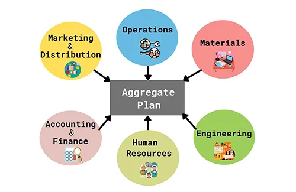
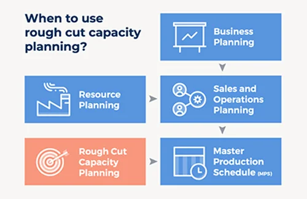

**راهنمای مطالب**
- [برنامه ریزی ادغامی](#برنامه-ریزی-ادغامی)
- [زمان بندی اصلی](#زمان-بندی-اصلی)
    - [ورودی های MS](#ورودی-های-ms)
    - [خروجی های MS](#خروجی-های-ms)
    - [سیاست های تولیدی در زمان بندی اصلی](#سیاست-های-تولیدی-در-زمان-بندی-اصلی)
- [برنامه ریزی ظرفیت سر انگشتی RCCP (Rough Cut Capacity Planning)](#برنامه-ریزی-ظرفیت-سر-انگشتی-rccp-rough-cut-capacity-planning)

## برنامه ریزی ادغامی
برنامه اصلی هر شرکت برای تولید محصول Aggregate Planning گفته می شود.
در برنامه ریزی ادغامی (Aggregate Planning) به ازای هر یک از محصولات یک برنامه تولید میان مدت بصورت ماهیانه ایجاد می شود.

## زمان بندی اصلی
برنامه زمان بندی اصلی (Master Scheduling) محور فعالیت های شرکت در زمینه مهندسی، خرید، ساخت، فروش و امور مالی می باشد. افق برنامه ریزی در MS کوتاه تر از Aggregate Planning است. چرا که Aggregate Planning بصورت ماهیانه بود اما در MS ما میخواهیم کار را خورد کرده و دقیق تر برنامه تولید را برای هفته مشخص نماییم.

برنامه زمان بندی اصلی (Master Scheduling) پایه برنامه ریزی کوتاه مدت است که آن را به عنوان قلب برنامه ریزی تولید و کنترل موجودی می شناسند. کار اصلی آن ایجاد ارتباط بین برنامه ریزی میان مدت و کوتاه مدت می باشد.

بعد از ایجاد MS براساس محصولات مختلف اکنون با توجه به برنامه ریزی اولیه، ظرفیت تولید، نیروی انسانی، ظرفیت ماشین آلات، مقدار انبار در دسترس، مواد اولیه و سایر منابع کلیدی که می توانند ما را محدود نموده و به نوعی ظرفیت تولیدی ما هستند را نهایی می کنیم.

اکنون وارد MS اولیه شده ایم و یکسری موارد دیگه ای نظیر برنامه اولیه، ظرفیت تولید و سایر محدودیت ها و ظرفیت های تولیدی را داخل MS اولیه وارد می کنیم و به نوعی MS مان را نهایی میکنیم. یعنی با توجه به ظرفیت موجود در واحد تولیدی، اکنون می توانیم این MS را داشته باشیم که به این کار RCCP یا برنامه ریزی سر انگشتی ظرفیت می گویند که در بخش های آتی به آن می رسیم.

### ورودی های MS
1.	تعهدات یا سفارشات مشتری: هر مشتری یکسری سفارش طی بازه هفتگی به ما داده و ما هم تعهدات و قولهای در جهت زمان آماده سازی و تحویل به او داده ایم. مواردی که قطعی هستند را در اینجا ذکر می کنیم. 
2.	پیش بینی تقاضا
3.	موجودی ابتدای دوره
4.	ذخیره اطمینان
5.	سیاست های تولیدی

### خروجی های MS
1.	زمان بندی اصلی تولید (MPS)
2.	موجودی برنامه ریزی شده (Projected on Hand): POH اولیه (میزان موجودی باقی مانده قبل از صدور MPS) و POH ثانویه (میزان موجودی باقی مانده بعد از صدور MPS)
3.	مقدار قابل قول دادن (Available to Promise): مقداری از موجودیست که تعهدی برای آن وجود ندارد.

### سیاست های تولیدی در زمان بندی اصلی
*	سیاست بهر به بهر (LfL): تولید تا زمان رفع تقاضا یا رسیدن به نقطه اطمینان انجام می شود.
*	سیاست بهر ثابت (LfB): در هر بار اقدام برای تولید، به اندازه دسته اقتصادی تولید یا ضریبی از آن تولید انجام می شود.

عاملی که باعث اختلاف بین این دو می شود تا یکی از این سیاست ها را انتخاب نماییم هزینه راه اندازی ماشین آلات و تجهیزات می باشد.

## برنامه ریزی ظرفیت سر انگشتی RCCP (Rough Cut Capacity Planning)
ترکیب کردن ظرفیت ها، محدودیت ها و منابع کلیدی موجودی سازمان با برنامه اصلی تولید (MPS اولیه) به منظور نهایی نمودن آن است.

**ظرفیتها و محدودیتها:**
*	ظرفیت در دسترس ماشین آلات
*	ظرفیت تولید توسط نیروی انسانی
*	مواد اولیه
*	ظرفیت انبارهای سازمان
*	راندمان کاری
*	زمان در دسترس (مهمترین و کلیدی ترین محدودیت)

[برنامه ریزی ادغامی]: #برنامه-ریزی-ادغامی
[زمان بندی اصلی]: #زمان-بندی-اصلی
[ورودی های MS]: #ورودی-های-ms
[خروجی های MS]: #خروجی-های-ms
[سیاست های تولیدی در زمان بندی اصلی]: #سیاست-های-تولیدی-در-زمان-بندی-اصلی
[برنامه ریزی ظرفیت سر انگشتی RCCP (Rough Cut Capacity Planning)]: #برنامه-ریزی-ظرفیت-سر-انگشتی-rccp-rough-cut-capacity-planning