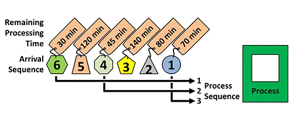
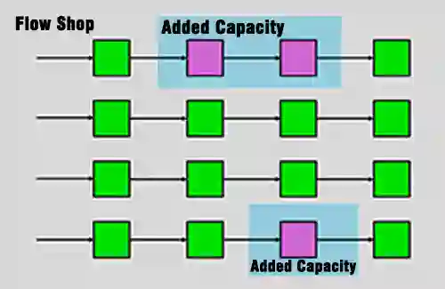

**راهنمای مطالب**

- [توالی عملیات و زمان بندی عملیات](#توالی-عملیات-و-زمان-بندی-عملیات)
- [سیستم تولید دسته ای](#سیستم-تولید-دسته-ای)
- [زمان بندی عملیات](#زمان-بندی-عملیات)
    - [اولویت بندی فعالیتها بر روی یک ماشین](#اولویت-بندی-فعالیتها-بر-روی-یک-ماشین)
        - [روش FIFO (First in First Out)](#روش-fifo-first-in-first-out)
        - [روش LIFO (Last in First Out)](#روش-lifo-last-in-first-out)
        - [روش (Short Process Time) SPT](#روش-short-process-time-spt)
        - [روش EDD](#روش-edd)
        - [روش S/O (نسبت زمان لنگی)](#روش-so-نسبت-زمان-لنگی)
    - [اولویت بندی فعالیتها بر روی بیش از یک ماشین (موازی)](#اولویت-بندی-فعالیتها-بر-روی-بیش-از-یک-ماشین-موازی)
    - [اولویت بندی فعالیتها بر روی بیش از یک ماشین (متوالی)](#اولویت-بندی-فعالیتها-بر-روی-بیش-از-یک-ماشین-متوالی)
- [قانون جانسون (Johnson)](#قانون-جانسون-johnson)
    - [شرایط بکارگیری قانون جانسون برای دو ماشین و n فعالیت](#شرایط-بکارگیری-قانون-جانسون-برای-دو-ماشین-و-n-فعالیت)
    - [شرایط بکارگیری قانون جانسون برای سه ماشین و n فعالیت](#شرایط-بکارگیری-قانون-جانسون-برای-سه-ماشین-و-n-فعالیت)

## توالی عملیات و زمان بندی عملیات
یعنی تعیین ترتیب یک کار بر روی یک ایستگاه کاری یا مراکز کاری مختلف.

**مزایا:**
*	پاسخگویی به موقع به نیازها و سفارشات موجود
*	کاهش بیکاری ها و استفاده بهینه از نیروی انسانی و ماشین آلات
*	جلوگیری از انباشت سرمایه

قصد داریم در رابطه با توالی عملیات در سیستم تولید دسته ای صحبت کنیم. گرچه سیستم تولید انبوه و کارگاهی هم داریم. 

> [مطلب پیشنهادی: بررسی قابلیت ها و قیمت نرم افزار برنامه ریزی تولید سایان](https://www.hooshkar.com/Software/Fennec/Module/ProductionPlanning)

## سیستم تولید دسته ای
سیستمی است که میانه سیستم تولید انبوه و کارگاهی قرار گرفته است. هم از نظر تیراژ تولید و هم از نظر تنوع. پس میتوانیم پس از آشنایی با آن، آن را به دو سیستم دیگر تعمیم دهیم.
سیستم تولید دسته ای بیشتر بصورت Make to Stock است (تولید برای انبار). مثل نوشابه سازی، داروسازی، محصولات آرایشی بهداشتی و...
روند کار به این ترتیب است که اول از همه محصولی تولید می شود که موجودی انبار آن رو به پایان باشد. 

## زمان بندی عملیات

### اولویت بندی فعالیتها بر روی یک ماشین

یک ماشین وقتی که در زمان کار است یا یک ایستگاه کاری، فعالیت های مختلفی به آن قسمت ارجاع داده می شود و در واقع فعالیت هایی که در صف انتظار قرار دارند باید بر روی آنها اولویت بندی انجام شود که کدام یکی زودتر باید انجام شوند.

#### روش FIFO (First in First Out)
فعالیتی که زودتر به صف انتظار وارد شده خدمت می گیرد. مثل صف اتوبوس، نانوایی

#### روش LIFO (Last in First Out)
فعالیتی که دیرتر به صف انتظار وارد شده خدمت می گیرد. مثل آسانسور

#### روش (Short Process Time) SPT
فعالیت های با زمان عملیات کوتاه تر در اولویت قرار دارند.

#### روش EDD
فعالیت هایی در اولویت هستند که موعد تحویل زودتری دارند.

#### روش S/O (نسبت زمان لنگی)
زمان لنگی (زمان باقیمانده تا موعد تحویل منهای زمان عملیات باقیمانده برای قطعه) کوچکتری دارند. این نسبت با تقسیم زمان لنگی به تعداد فعالیت باقیمانده از یک قطعه به دست می آید.

**محاسبه شاخص های کلیدی عملکرد در این روش:**

*	**دیرکرد:** مقدار زمانی که یک فعالیت بیش از موعد تحویل خود طول می کشد. بعنوان مثال موعد تحویل کالایی 16 روز دیگر است و زمانی که کالا آماده می شود 18 روز زمان می برد پس دو روز دیرکرد داشته ایم.
*	**متوسط دیرکرد:** متوسط زمان دیرکرد در میان تمام فعالیت هایی که بر روی یک ایستگاه کاری زمان بندی می شوند.
*	**زمان جریان:** مجموع زمان پایان فعالیت های زمان بندی شده بر روی یک ایستگاه کاری.
*	**متوسط زمان جریان:** میانگین زمان جریان برای تمام فعالیت های زمان بندی شده بر روی یک ایستگاه کاری.
*	درصدی از فعالیت ها که دچار تاخیر می شوند یا درصدی از فعالیت ها که بدون تاخیر انجام می شوند.

### اولویت بندی فعالیتها بر روی بیش از یک ماشین (موازی)

مثلا در سیستم تولید کارگاهی، درون یک کارگاه، ماشین آلات از نوع موازی هستند. هدف در این مسائل کمینه کردن متوسط زمان گردش کار در کل کارگاه است.

### اولویت بندی فعالیتها بر روی بیش از یک ماشین (متوالی)

در واقع این نوع زمان بندی مناسب خطوط تولیدی یا Flowshop هستند.
به طور کلی می توان گفت که هیچ راه حل بهینه ای که بتواند زمان بندی مناسبی برای کارهایی که باید روی بیش از دو ماشین انجام شود وجود ندارد. (اما در روش های فرا ابتکاری و ارائه سناریوهای مختلف با استفاده از نرم افزار MATLAB این امکان وجود دارد اما خیلی پیچیده و سخت می باشد.)
در نتیجه زمان بندی به تنهایی یک شاخه از علم نیست و معمولا یکی از وظایف روزمره مدیران برای تصمیم گیری هاست. اغلب اوقات زمان های راه اندازی و عملیات به صورت ثابت از قبل قابل محاسبه نیستند و متغیر هستند.
راه حل بهینه برای حل مسائل زمان بندی دو ماشین و سه ماشین (در شرایط خاص) استفاده از قانون جانسون می باشد.

## قانون جانسون (Johnson)
تکنیکی است که با استفاده از آن می توان زمان لازم جهت اجرای گروهی از فعالیت ها را به حداقل رساند. 

زمان لازم جهت انجام گروهی از فعالیت ها (Make Span)
برابر مجموع زمان عملیاتی لازم برای فعالیت ها بر روی ماشین آلات، زمان حمل و نقل های لازم و زمان های انتظار برای فعالیت بعدی است.

### شرایط بکارگیری قانون جانسون برای دو ماشین و n فعالیت

زمان عملیات برای همه فعالیت های موجود در یک کار (که مجموعه ای از فعالیت های متوالی است) باید مستقل از هم باشد. 
زمان عملیات (شامل زمان راه اندازی و زمان فرآیند) باید شناخته شده و ثابت برای هر فعالیت در هر ماشین باشد.
همه کارها باید شامل دو فعالیت که هر یک بر روی یکی از ماشین ها انجام شود باشد.
همه کارهای موجود ابتدا باید فعالیتی که بر روی ماشین 1 دارند را تکمیل نمایند و سپس به سراغ فعالیت ماشین 2 بروند.

*	ابتدا تمام کارها و زمان های عملیاتی برای فعالیت ها بر روی ماشین ها را لیست کنید.
*	فعالیتی که کوتاه ترین زمان را دارد انتخاب نمایید اگر این فعالیت بر روی ماشین 1 انجام می شود آن را در ابتدای صف زمان بندی کنید در صورتی که فعالیت بر روی ماشین 2 باید انجام شود آن را به انتهای صف منتقل کنید.
*	این فعالیت را از فرایند تصمیم گیری کنار بگذارید.
*	گام های 2 و 3 را تا آنجا که همه فعالیت ها زمان بندی شوند ادامه دهید.

### شرایط بکارگیری قانون جانسون برای سه ماشین و n فعالیت

در صورتی که کوچکترین زمان عملیات روی یکی از ماشین های 1 یا 3 از بزرگترین زمان عملیات روی ماشین 2 کوچکتر نباشد (شرط برای یکی از ماشین ها کافیست) می توان کارهای ماشین 2 و دو ماشین دیگر را ادغام نمود و مساله را از قانون جانسون حل کرد.

[توالی عملیات و زمان بندی عملیات]: #توالی-عملیات-و-زمان-بندی-عملیات
[سیستم تولید دسته ای]: #سیستم-تولید-دسته-ای
[زمان بندی عملیات]: #زمان-بندی-عملیات
[اولویت بندی فعالیتها بر روی یک ماشین]: #اولویت-بندی-فعالیتها-بر-روی-یک-ماشین
[روش FIFO (First in First Out)]: #روش-fifo-first-in-first-out
[روش LIFO (Last in First Out)]: #روش-lifo-last-in-first-out
[روش (Short Process Time) SPT]: #روش-short-process-time-spt
[روش EDD]: #روش-edd
[روش S/O (نسبت زمان لنگی)]: #روش-so-نسبت-زمان-لنگی
[اولویت بندی فعالیتها بر روی بیش از یک ماشین (موازی)]:#اولویت-بندی-فعالیتها-بر-روی-بیش-از-یک-ماشین-موازی
[اولویت بندی فعالیتها بر روی بیش از یک ماشین (متوالی)]:#اولویت-بندی-فعالیتها-بر-روی-بیش-از-یک-ماشین-متوالی
[قانون جانسون (Johnson)]: #قانون-جانسون-johnson
[شرایط بکارگیری قانون جانسون برای دو ماشین و n فعالیت]:#شرایط-بکارگیری-قانون-جانسون-برای-دو-ماشین-و-n-فعالیت
[شرایط بکارگیری قانون جانسون برای سه ماشین و n فعالیت]:#شرایط-بکارگیری-قانون-جانسون-برای-سه-ماشین-و-n-فعالیت