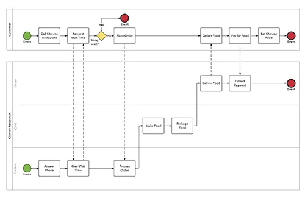
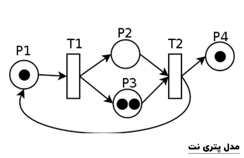
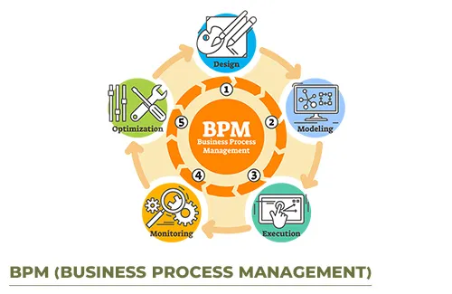

**راهنمای مطالب**
- [مقدمه](#مقدمه)
- [تاریخچه BPMN](#تاریخچه-bpmn)
- [استانداردهای قبل از BPMN](#استانداردهای-قبل-از-bpmn)
    - [1. نمودار زنجیره فرایند رویداد EPC (Event-driven Process Chain)](#1-نمودار-زنجیره-فرایند-رویداد-epc-event-driven-process-chain)
    - [2. زبان مدلسازی یکپارچه UML (Unified Modeling Language)](#2-زبان-مدلسازی-یکپارچه-uml-unified-modeling-language)
    - [3. مدل IDEF (Integrated Definition)](#3-مدل-idef-integrated-definition)
    - [4. مدل Petri Nets](#4-مدل-petri-nets)
    - [5. نموداری عمومی (Flowchart)](#5-نموداری-عمومی-flowchart)
- [تفاوت BPM با BPMN چیست](#تفاوت-bpm-با-bpmn-چیست)
- [هدف مدلسازی مدیریت فرآیند کسب و کار چیست](#هدف-مدلسازی-مدیریت-فرآیند-کسب-و-کار-چیست)
- [مزایای مدلسازی فرآیند کسب و کار چیست](#مزایای-مدلسازی-فرآیند-کسب-و-کار-چیست)
- [نقش BPMN در نرم افزارهای ERP](#نقش-bpmn-در-نرم-افزارهای-erp)
- [مزایای استفاده از BPMN در نرم افزارهای ERP](#مزایای-استفاده-از-bpmn-در-نرم-افزارهای-erp)
- [تفاوت BPMN و BPMS](#تفاوت-bpmn-و-bpms)

## مقدمه
به معنای Business Process Model and Notation است و یک استاندارد برای نمایش فرایندهای کسب و کار است.

## تاریخچه BPMN

استاندارد BPMN در سال ۲۰۰6 توسط یک گروه کاری به نام Object Management Group (OMG) پذیرفته شد. [OMG](https://www.omg.org/) یک سازمان بین‌المللی است که در زمینه توسعه استانداردهای صنعتی و فناوری اطلاعات فعالیت می‌کند.

قبل از BPMN، استانداردهای دیگری نیز برای مدلسازی فرآیندهای کسب و کار وجود داشت؛ اما این استانداردها به دلیل محدودیت‌هایی که دارا بودند، نمی‌توانستند به بهترین شکل ممکن فرآیندهای کسب و کار را مدل‌سازی کنند. در نتیجه، OMG تصمیم گرفت تا استاندارد BPMN را ایجاد کند که بتواند به بهترین شکل ممکن فرآیندهای کسب و کار را مدل‌سازی نماید.

در حال حاضر، BPMN یکی از پراستفاده‌ترین استانداردهای مدلسازی فرآیند کسب و کار در سراسر جهان است و به عنوان یک ابزار کارآمد در بسیاری از صنایع و سازمان‌ها مورد استفاده قرار می‌گیرد.

## استانداردهای قبل از BPMN
قبل از ایجاد استاندارد BPMN، استانداردهای دیگری برای مدلسازی فرآیندهای کسب و کار وجود داشتند که به عنوان پیشینه و بستری برای توسعه استاندارد BPMN عمل کردند. به عنوان مثال:

### 1. نمودار زنجیره فرایند رویداد EPC (Event-driven Process Chain)
زنجیره فرایند رویداد یک روش برای مدلسازی فرآیندهای کسب و کار است که در دهه 1990 میلادی توسط August-Wilhelm Scheer ابداع شد. این نمودار برای نمایش رویدادها و عملیات مربوط به فرآیندهای سازمان مورد استفاده قرار می‌گیرد. این زبان مدل سازی بر پایه استانداردARIS  شکل گرفته است.

### 2. زبان مدلسازی یکپارچه UML (Unified Modeling Language)
نمودارهای استاندارد UML دو دید مختلف ایستا (ساختاری) و دید پویا (رفتاری) هستند که به کمک آنها می توان ساختار و رفتار سیستم را نمایش داد.
و از معایب استفاده از UML حجم بالای استانداردهای مورد استفاده در آن است که می تواند باعث ایجاد پیچیدگی در مدلسازی شود. همچنین، بعضی از استانداردهای UML به دلیل کاربرد کمتر، به ندرت استفاده می شوند و این نیز می تواند باعث کاهش کارایی در مدلسازی شود.

### 3. مدل IDEF (Integrated Definition)
مدل IDEF در سال 1981 که توسط نیروی هوایی ارتش آمریکا برای تهیه مدل‌های یکنواخت و تعریف شده توسعه یافت.

### 4. مدل Petri Nets
یک روش قدیمی و بهترین زبان مدل سازی فرآیندهای کسب و کار می‌باشد که در سال 1939 توسط Carl Adam Petri ابداع شد. به کمک این مدل می‌توانیم همزمانی و همروندی بین فرایندها را به خوبی نمایش دهیم. پتری نت دارای سه مفهوم: جایگاه (مستطیل)، انتقال (دایره) و نشانه (که نشانه بین جایگاه ها جابجا می شود) است.

### 5. نموداری عمومی (Flowchart)
نمودار عمومی یا Flowchart یک نمودار گرافیکی ساده است که شروع و پایان فعالیت با بیضی، مراحل فرایند با مستطیل و تصمیم گیری‌ها با لوزی نمایش داده می‌شوند.

## تفاوت BPM با BPMN چیست
در واقع BPM (Business Process Management) به مجموعه فرآیندها و روش‌هایی اطلاق می‌شود که برای بهبود و بهینه سازی فرایندهای کسب و کار استفاده می‌شود. این فرآیندها ممکن است شامل شناسایی، طراحی، پیاده سازی، اجرا و نظارت بر فرایندها باشد.

و BPMN یک زبان گرافیکی است که برای توصیف و طراحی فرایندهای کسب و کار استفاده می‌شود. این استاندارد به توسعه‌دهندگان و مدیران فرایند کمک می‌کند تا بتوانند فرآیندهای کسب و کار را به صورت بصری و قابل فهم توصیف کنند.

بنابراین، اصلی‌ترین تفاوت بین BPM و BPMN در این است که BPM به مجموعه فرآیندهای مدیریت فرایندهای کسب و کار اشاره دارد، در حالی که BPMN یک استاندارد برای نمایش و طراحی فرآیندهای کسب و کار است. به عبارت دیگر، BPMN یکی از ابزارهایی است که برای پشتیبانی از فرآیندهای BPM به کار می‌رود.

> [مطلب پیشنهادی: نرم‌افزار BPMS چیست؟](https://www.hooshkar.com/Wiki/Business/WhatIsBpms)

## هدف مدلسازی مدیریت فرآیند کسب و کار چیست
هدف اصلی مدلسازی فرآیند کسب و کار، بهبود و بهینه‌سازی فرایندهای کسب و کار است. با مدل‌سازی فرایندها، می‌توان بهترین روش‌های اجرای فرآیندها را شناسایی کرده و برای بهبود و بهینه‌سازی آن‌ها از روش‌هایی مانند استانداردسازی و اتوماسیون استفاده کرد.

با استفاده از مدل‌سازی فرآیندها، می‌توان فرایندهای کسب و کار را به صورت بصری و دقیق توصیف کرد و اطمینان حاصل کرد که تمامی اعضای تیم با یک تصویر کلی از فرآیند آشنا هستند. همچنین، با استفاده از مدل‌سازی، می‌توان به سادگی اقدام به تعریف مسیرهای مختلف فرایند، توصیف دقیق وظایف مرتبط با فرایند، مشخص کردن نقاط ضعف و قوت فرایند و تشریح راه‌حل‌های بهینه‌سازی آن‌ها کرد.

بنابراین، با استفاده از مدل‌سازی فرآیند کسب و کار، سازمان‌ها می‌توانند بهبود کیفیت فرآیندهای خود را دریافت کنند، هزینه‌ها را کاهش دهند، زمان اجرا و ارائه سرویس‌ها را کاهش دهند و همچنین سطح رضایت مشتریان خود را افزایش دهند.

## مزایای مدلسازی فرآیند کسب و کار چیست

**1. بهبود ارتباطات:** مدل‌سازی فرآیندهای کسب و کار می‌تواند بهبود ارتباطات داخلی و خارجی سازمان را فراهم کند. با استفاده از مدل‌های بصری و مفهومی، افراد مختلف می‌توانند به سادگی فرآیندهای سازمان را درک کنند و هماهنگی بهتری را بین بخش‌ها و اعضای تیم فراهم کنند.

**2. بهینه‌سازی فرآیندها:** با استفاده از مدل‌سازی، می‌توان به سادگی نقاط ضعف و قوت فرآیندها را شناسایی کرده و بهینه‌سازی آن‌ها را انجام داد. این کار می‌تواند به کاهش هزینه‌ها، افزایش بهره‌وری و بهبود کیفیت خدمات و محصولات سازمان منجر شود.

**3. کاهش خطا:** با استفاده از مدل‌سازی، می‌توان خطاهای احتمالی در فرآیندها را شناسایی کرده و راه‌حل‌های مناسبی برای جلوگیری از آن‌ها پیشنهاد داد.

**4. سهولت ارتقاء:** با توجه به سرعت تغییرات در عصر دیجیتال، سازمان‌ها نیاز دارند تا به سرعت بهبود و تغییرات را اعمال کنند. با استفاده از مدل‌سازی فرآیند، به سهولت می‌توان اصلاحات و بهبودهای لازم را انجام داد و فرآیندهای سازمان را بهبود بخشید.

**5. افزایش توانایی تصمیم‌گیری:** با داشتن مدل‌های دقیق از فرآیندهای کسب و کار، می‌توان به سهولت تحلیل‌های مختلفی از جمله تحلیل هزینه-سود (Cost-Benefit Analysis)، تحلیل مسیر انجام فعالیت‌ها (Activity Path Analysis)، تحلیل پوشش فرآیند (Process Coverage Analysis) و... را انجام داد. با توجه به این تحلیل‌ها، تصمیمات بهتر و دقیق‌تری درباره بهبود فرآیندها و سازمان اتخاذ می‌شود.

**6. بهبود مدیریت سازمان:** با داشتن مدل‌های دقیق از فرآیندهای کسب و کار، می‌توان ارتباطات بین بخش‌ها را بهبود داد و تصمیم‌گیری‌های بهتری را درباره مسائل مختلفی نظیر تقسیم وظایف، استفاده از منابع، تنظیم زمانبندی و... اتخاذ کرد.

**7. سهولت آموزش:** با استفاده از مدل‌های بصری و مفهومی، آموزش فرآیندها برای کارکنان جدید و همچنین ارتقای دانش و توانایی‌های کارکنان فعلی ساده‌تر و کارآمدتر می‌شود.

به طور کلی، مدل‌سازی فرآیند کسب و کار می‌تواند به بهبود کارایی، بهره‌وری، کیفیت و سودآوری سازمان‌ها کمک کند و برای مدیران و تیم‌های فنی و مدیریتی، ابزاری قدرتمند برای تصمیم‌گیری و بهبود فرآیندها باشد.

## نقش BPMN در نرم افزارهای ERP
در واقع BPMN به عنوان یک استاندارد مدلسازی فرآیند کسب و کار، در نرم‌افزارهای ERP نقش مهمی در بهبود کیفیت و کارآیی فرآیندهای کسب و کار ایفا می‌کند. بسیاری از نرم‌افزارهای ERP از BPMN برای مدل‌سازی فرآیندها استفاده می‌کنند و این امر به بهبود سیستم‌های ERP کمک می‌کند.

استفاده از BPMN در نرم‌افزارهای ERP، امکان مدل‌سازی و بهینه‌سازی فرآیندهای کسب و کار را فراهم می‌کند و این کار به کاهش هزینه‌ها، بهبود کیفیت خدمات و بهبود عملکرد کسب و کار کمک می‌کند.

## مزایای استفاده از BPMN در نرم افزارهای ERP

**1. بالا بردن توانایی شناسایی نیازهای مشتری:** با استفاده از BPMN در نرم‌افزارهای ERP، می‌توان فرآیندهای کسب و کار را بصورت دقیق و دستورالعمل‌هایی مشخص مدل‌سازی کرد. این کار باعث می‌شود که نیازهای مشتریان بهتر شناسایی شود و نرم‌افزارهای ERP، بتوانند به بهترین شکل پاسخگوی این نیازها باشند.

**2. بهبود عملکرد فرآیندها:** با استفاده از BPMN، می‌توان به بهترین شکل فرآیندهای کسب و کار را مدل‌سازی و بهینه‌سازی کرد. این کار به بهبود عملکرد فرآیندها، کاهش هزینه‌ها و بهبود کیفیت خدمات کمک می‌کند.

**3. کاهش زمان برای اجرای فرآیندها:** با استفاده از BPMN، می‌توان فرآیندهای کسب و کار را به بهترین شکل مدل‌سازی کرد و این کار باعث کاهش زمان برای اجرای فرآیندها می‌شود. در واقع، با مدل‌سازی فرآیندها به صورت دقیق و مشخص، انجام هر فعالیت در فرآیند کسب و کار به بهترین شکل و با کمترین زمان ممکن انجام خواهد شد.

**4. بهبود تعاملات:** با استفاده از BPMN، می‌توان فرآیندهای کسب و کار را به بهترین شکل مدل‌سازی کرد و این کار باعث بهبود تعاملات بین کاربران و سیستم‌های ERP خواهد شد.

**افزایش امنیت:** با استفاده از BPMN، می‌توان فرآیندهای کسب و کار را به بهترین شکل مدل‌سازی کرد و به این ترتیب از امنیت بیشتری در اجرای فرآیندهای کسب و کار برخوردار خواهیم بود.

بنابراین، استفاده از BPMN در نرم‌افزارهای ERP به بهبود عملکرد، کیفیت و کارآیی فرآیندهای کسب و کار کمک می‌کند.

## تفاوت BPMN و BPMS

مفهوم BPMN مخفف "Business Process Model and Notation" است و یک زبان ترسیمی برای نمایش فرایندهای کسب و کار به صورت گرافیکی و قابل فهم است. BPMN برای تحلیل، مستندسازی و بهبود فرآیندهای کسب و کار در سازمان‌ها استفاده می‌شود و این امکان را به شما می‌دهد تا فرآیندهای کاری را به صورت بصری و با استفاده از سمبل‌های گرافیکی نشان دهید.

در واقع BPMS مخفف "Business Process Management System" است و یک سیستم نرم‌افزاری است که برای طراحی، اجرا، مانیتورینگ و بهینه‌سازی فرآیندهای کاری استفاده می‌شود. BPMS ابزاری است که به سازمان‌ها کمک می‌کند تا فرآیندهای کاری خود را به صورت خودکار و بهینه‌سازی شده اجرا کنند.

بنابراین، BPMN  یک زبان ترسیمی برای نمایش فرآیندهای کاری است، در حالی که BPMS یک سیستم نرم‌افزاری است که برای مدیریت فرآیندهای کاری بهبود یافته استفاده می‌شود. به طور خلاصه،BPMN  به شما کمک می‌کند تا فرآیندهای کاری خود را ترسیم کنید، در حالی که BPMS به شما کمک می‌کند تا فرآیندهای کاری خود را مدیریت، بهینه‌سازی و بهبود بخشید.

[مقدمه]: #مقدمه
[تاریخچه BPMN]: #تاریخچه-bpmn
[استانداردهای قبل از BPMN]: #استانداردهای-قبل-از-bpmn
[1. نمودار زنجیره فرایند رویداد EPC (Event-driven Process Chain)]: #1-نمودار-زنجیره-فرایند-رویداد-epc-event-driven-process-chain
[2. زبان مدلسازی یکپارچه UML (Unified Modeling Language)]: #2-زبان-مدلسازی-یکپارچه-uml-unified-modeling-language
[3. مدل IDEF (Integrated Definition)]: #3-مدل-idef-integrated-definition
[4. مدل Petri Nets]: #4-مدل-petri-nets
[5. نموداری عمومی (Flowchart)]: #5-نموداری-عمومی-flowchart
[تفاوت BPM با BPMN چیست]: #تفاوت-bpm-با-bpmn-چیست
[هدف مدلسازی مدیریت فرآیند کسب و کار چیست]: #هدف-مدلسازی-مدیریت-فرآیند-کسب-و-کار-چیست
[مزایای مدلسازی فرآیند کسب و کار چیست]: #مزایای-مدلسازی-فرآیند-کسب-و-کار-چیست
[نقش BPMN در نرم افزارهای ERP]: #نقش-bpmn-در-نرم-افزارهای-erp
[مزایای استفاده از BPMN در نرم افزارهای ERP]: #مزایای-استفاده-از-bpmn-در-نرم-افزارهای-erp
[تفاوت BPMN و BPMS]: #تفاوت-bpmn-و-bpms