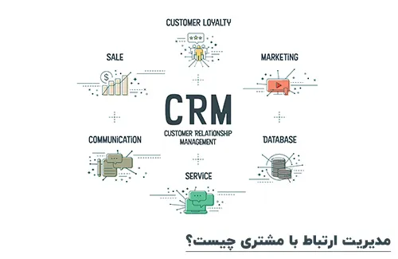

<blockquote style="background-color:#eeeefc; padding:0.5rem">

  
آنچه در این مطلب خواهید خواند

  <ul>
    <li>مخفف CRM چیست</li>
    <li>کاربردهای CRM در سازمان‌ها چیست</li>
  </ul>

</blockquote>

## مخفف CRM چیست
مدیریت ارتباط با مشتری یا CRM مخفف عبارت "Customer Relationship Management" است.

سازمان‌ها و شرکت‌ها از  <a href="https://www.hooshkar.com/Software/Fennec/Module/CRM" target="_blank">نرم افزار مدیریت ارتباط با  مشتری (CRM)</a> برای تعیین، جذب، گسترش، حفظ و بهبود ارتباط با مشتریان خود استفاده می‌کنند. 
این ارتباطات ممکن است از طریق کانال‌های مختلفی مانند تلفن، ایمیل، وب‌سایت‌ها، شبکه‌های اجتماعی و غیره برقرار شود.

هدف اصلی CRM، بهبود تجربه مشتریان، افزایش رضایت آن‌ها، ارتقاء فرآینده‌های فروش و بازاریابی، بهینه‌سازی خدمات پس از فروش و تقویت ارتباط بین سازمان و مشتریان است.

<blockquote style="background-color:#f5f5f5; padding:0.5rem">

<strong>بیشتر بخوانید: <a href="https://www.hooshkar.com/Wiki/Business/CrmAndErpDifferences" target="_blank">تفاوت CRM و  ERP چیست؟
</a>
</strong></blockquote>

## کاربردهای CRM در سازمان ها چیست

**1. مدیریت ارتباط با مشتریان:** سازمان‌ها می‌توانند تاریخچه تعاملات خود را با مشتریان ثبت کرده و اطلاعاتی مانند خریدهای قبلی، تماس‌های تلفنی، ایمیل‌ها و درخواست‌ها را در یک مکان مرکزی نگهداری کنند. این امکان به کارکنان کمک می‌کند تا اطلاعات کامل و به‌روزی در مورد مشتریان داشته باشند و در تعاملات بعدی با آنها موثرتر عمل کنند.

**2. بهبود تجربه مشتری:** از طریق آنالیز اطلاعات مشتریان، سازمان‌ها می‌توانند روند خرید و رفتار مشتریان را درک کرده و به طور خاص و سفارشی به نیازها و تمامیت‌های آنها پاسخ دهند.

**3. بهبود فرآیندهای فروش و بازاریابی:** از طریق تحلیل داده‌های مشتری و پیگیری فعالیت‌ها، سازمان‌ها می‌توانند بهترین استراتژی‌ها و تماس‌های فروش را شناسایی کنند و فرصت‌های فروش را بهبود بخشند.

<blockquote style="background-color:#f5f5f5; padding:0.5rem">

<strong>بیشتر بخوانید: <a href="https://www.hooshkar.com/Wiki/Business/WhatIsErp" target="_blank">ERP چیست؟
</a>
</strong></blockquote>

**4. بهبود خدمات پس از فروش:** با داشتن اطلاعات کاملی از مشتریان و تاریخچه خریدها، سازمان‌ها می‌توانند خدمات پس از فروش بهتری را ارائه دهند، مشکلات و نیازهای مشتریان را بهبود بخشند و ارتباط مستدام با مشتریان خود را برقرار کنند.

**5. بهبود هماهنگی داخلی:** اطلاعات مشتریان و تاریخچه تعاملات با آنها در سیستم CRM قابل دسترسی است و اعضای تیم‌های مختلف می‌توانند به صورت هماهنگ از این اطلاعات استفاده کنند و در تصمیم‌گیری‌ها و برنامه‌ریزی‌ها از آنها بهره‌برداری کنند.

**6. افزایش رضایت و وفاداری مشتریان:** با داشتن اطلاعات کامل و جامع درباره مشتریان و تعاملات قبلی با آنها، سازمان‌ها می‌توانند خدمات و محصولات خود را بر اساس نیازها و ترجیحات مشتریان ایجاد کنند. همچنین این اطلاعات سبب کاهش زمان پاسخگویی به نیازها و شکایات مشتریان شده که می‌تواند به افزایش رضایت مشتریان و حفظ وفاداری آنها کمک کند.

**7. بهبود امنیت و حفاظت اطلاعات:** با داشتن سیستم مرکزی برای ذخیره و مدیریت اطلاعات مشتریان، امنیت و حفاظت از اطلاعات حساس مشتریان بهبود یافته و احتمال نفوذ و دسترسی غیرمجاز به اطلاعات کاهش می‌یابد.