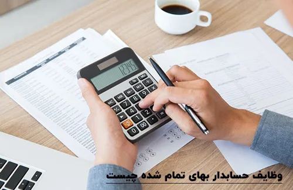

**راهنمای مطالب**

- [بهای تمام شده چیست](#بهای-تمام-شده-چیست)
- [حسابداری بهای تمام شده چیست](#حسابداری-بهای-تمام-شده-چیست)
- [برخی از وظایف حسابدار بهای تمام شده عبارتند از](#برخی-از-وظایف-حسابدار-بهای-تمام-شده-عبارتند-از)
- [اصل بهای تمام شده](#اصل-بهای-تمام-شده)
- [حسابداری صنعتی چیست](#حسابداری-صنعتی-چیست)
- [انواع بهای تمام شده با توجه به نوع هزینه ها](#انواع-بهای-تمام-شده-با-توجه-به-نوع-هزینه‌-ها)
- [محاسبه بهای تمام شده در شرکت های تولیدی](#محاسبه-بهای-تمام-شده-در-یک-شرکت-تولیدی)
- [محاسبه بهای تمام شده در شرکت های خدماتی](#محاسبه-بهای-تمام-شده-در-شرکت‌های-خدماتی)
- [فرمول بهای تمام شده](#فرمول-بهای-تمام-شده)
## بهای تمام شده چیست

فرض کنید که شما می‌خواهید محصول یا خدمتی را به بازار عرضه کنید؛ در این صورت ابتدا باید قیمت نهایی آن را مشخص کنید. برای تعیین قیمت نهایی، شما باید هزینه‌هایی که برای تولید یا ارائه آن محصول یا خدمت صرف می‌کنید را دقیقاً در نظر بگیرید تا بتوانید میزان سود را محاسبه کنید. 

مفهوم بهای تمام شده یکی از شاخص‌های مهم در این رابطه است و به تمامی هزینه‌های مرتبط با تولید یا ارائه خدمت اشاره دارد. از طریق دانش دقیق از این مفهوم، شما می‌توانید تصمیم‌گیری‌های حیاتی مانند تعیین حقوق و دستمزد کارکنان، تعیین قیمت محصول، کاهش هزینه‌ها و تقویت توان رقابتی خود در بازار را به درستی انجام دهید.

بهای تمام شده به هزینه‌های مستقیم مرتبط با تولید و فروش کالاهای عرضه شده اشاره دارد. به عبارت دیگر، بهای تمام شده به تمامی هزینه‌های مواد اولیه مصرفی و دستمزد نیروی کار مستقیم در تولید کالا مرتبط است. این مفهوم مستقیماً هزینه‌های توزیع و فروش که به عنوان هزینه‌های غیرمستقیم در نظر گرفته می‌شوند را در محاسبات خود در نظر نمی‌گیرد.

به عبارت ساده‌تر، بهای تمام شده کالا به معنای محاسبه هزینه‌های مستقیمی است که در تولید کالا یا ارائه خدمت تاثیر دارند. این هزینه‌ها شامل دستمزد کارکنان، هزینه‌های مواد اولیه و هزینه‌های سربار تولید می‌شوند. 

<blockquote style="background-color:#f5f5f5; padding:0.5rem">
مطلب پیشنهادی: آشنایی با امکانات <a href="https://www.hooshkar.com/Software/Fennec/Module/Costing" target="_blank">نرم افزار بهای تمام شده
</a></blockquote>

## حسابداری بهای تمام شده چیست

با توجه به توسعه حوزه علم حسابداری و نیاز به دستیابی به اهداف خاص و دقیق هر نوع کسب و کار، حسابداری به چندین زیرشاخه تخصصی تقسیم شده است. حسابداری بهای تمام شده، یک زیرشاخه از <a href="https://www.hooshkar.com/Wiki/Financial/CostAccounting" target="_blank">حسابداری صنعتی</a> است که وظیفه جمع‌آوری اطلاعات مرتبط با هزینه‌ها را دارد، سپس محاسبات بهای تمام شده برای محصولات و خدمات صورت می‌گیرد و روش‌های کاهش بهای تمام شده و بهبود عملکرد تولیدات تحلیل و ارائه می‌شود. این اطلاعات از طریق تحلیل گزارش‌ها و بررسی روش‌های تولید به مدیران ارائه می‌شوند. اصول حسابداری بهای تمام شده به سازمان‌ها کمک می‌کند تا عملکرد مالی و عملیاتی خود را بهبود بخشند و منابع خود را بهینه‌سازی کنند.

<blockquote style="background-color:#f5f5f5; padding:0.5rem">
مطلب پیشنهادی: ویژگی های <a href="https://www.hooshkar.com/Wiki/Financial/TheBestInventorySoftware" target="_blank">بهترین نرم افزار انبارداری
</a></blockquote>

## برخی از وظایف حسابدار بهای تمام شده عبارتند از

**1. بررسی و ارزیابی موجودی‌ها:** حسابدار بهای تمام شده باید موجودی‌های مختلف مواد اولیه، محصولات نهایی و سایر منابع را بررسی و ارزیابی کند. این اطلاعات مهم است تا بتوان بهای تمام شده محصولات را به درستی محاسبه کرد.

**2. انجام تصمیم‌گیری‌های آینده:** با تجزیه و تحلیل اطلاعات مالی و بهای تمام شده، حسابدار می‌تواند تصمیم‌گیری‌های مرتبط با آینده را انجام دهد. این شامل تصمیم‌گیری در مورد تولید، قیمت‌گذاری و بهینه‌سازی هزینه‌ها می‌شود.

**3. گردآوری و تقسیم‌بندی هزینه‌ها:** حسابدار بهای تمام شده مسئول جمع‌آوری و دسته‌بندی هزینه‌ها به شکل دقیق و منظم است. این اطلاعات اساسی برای محاسبه بهای تمام شده محصولات و خدمات می‌باشد.

**4. ایجاد روش‌های کنترل هزینه‌ها:** حسابدار بهای تمام شده باید روش‌ها و سیاست‌هایی را ایجاد کند که به کنترل هزینه‌ها کمک کنند. این شامل ارائه پیشنهادات برای کاهش هزینه‌ها و بهبود کارایی می‌شود.

**5. ارائه راهکارهای بهتر به مدیران:** حسابدار بهای تمام شده مسئول ارائه راهکارهای مالی به مدیران است. این اطلاعات مهم برای تصمیم‌گیری‌های استراتژیک و اجرایی سازمان است.

**6. تحلیل و بررسی موجودی کالاها:** حسابدار بهای تمام شده برای قیمت‌گذاری محصولات و کنترل موجودی‌ها، باید موجودی‌های کالاها را با دقت تحلیل و بررسی کند. این اطلاعات اساسی برای تعیین قیمت‌ها و مدیریت موجودی‌ها می‌باشد.

<blockquote style="background-color:#f5f5f5; padding:0.5rem">
مطلب پیشنهادی: ویژگی های <a href="https://www.hooshkar.com/Wiki/Financial/TheBestCostAccountingSoftware" target="_blank">بهترین نرم افزار بهای تمام شده
</a></blockquote>

## اصل بهای تمام شده

اصل بهای تمام شده یکی از <a href="https://www.hooshkar.com/Wiki/Financial/AccountingPrinciples" target="_blank">اصول حسابداری</a> است که در حسابداری مالی تاثیر می‌گذارد. این اصل بر مبنای مفروضات و اصول حسابداری توضیح داده می‌شود. اصل بهای تمام شده، در واقع به تاریخ‌گذاری مالیاتی رویدادهای مالی اشاره دارد.

این اصل بیان می‌کند که تمامی رویدادهای مالی، با در نظر گرفتن قیمت زمان وقوع (یعنی وقوع رویداد) ثبت می‌شوند و اثر گذر زمان و تغییرات ارزش پول در ارائه گزارشات مالی تاثیری ندارد. به عبارت دیگر، معاملات مالی بر اساس ارزش آنها در زمان وقوع ثبت می‌شوند و تغییرات در ارزش ارز و تغییرات زمانی در ارزش مالیاتی معاملات در نظر گرفته نمی‌شوند.

## حسابداری صنعتی چیست

حسابداری بهای تمام شده بخشی از حسابداری صنعتی است که به تعیین، تجزیه و تحلیل هزینه‌ها و عملیات مالی در صنایع و شرکت‌های تولیدی متمرکز است اما هدف اصلی حسابداری صنعتی، علاوه بر موارد بالا، تمرکز بر روی محل وقوع هزینه ها و بهبود تخصیص آنهاست.

## انواع بهای تمام شده با توجه به نوع هزینه ها

**1. بهای تمام شده مستقیم:** این نوع بهای تمام شده معمولاً برای تولیدی‌ها و شرکت‌هایی که هزینه‌های مستقیم به تولید کالاها مهم هستند، مورد استفاده قرار می‌گیرد. این روش همه هزینه‌های مستقیم مانند مواد اولیه و دستمزد نیروی کار را لحاظ می‌کند.

**2. بهای تمام شده غیرمستقیم:** در این نوع بهای تمام شده، هزینه‌هایی که به طور غیرمستقیم به تولید کالاها مرتبط هستند مانند هزینه‌های ماشین‌آلات و تجهیزات تولیدی نیز در محاسبات در نظر گرفته می‌شوند.

<blockquote style="background-color:#f5f5f5; padding:0.5rem">
مطلب پیشنهادی:  <a href="https://www.hooshkar.com/Wiki/Financial/TpTaxGov" target="_blank">سامانه مودیان مالیاتی چیست؟
</a></blockquote>

**3. بهای تمام شده فرصت از دست رفته:** در این روش، بهای تمام شده با توجه به فرصت‌هایی که از دست می‌روند محاسبه می‌شود. مثلاً، اگر یک شرکت تصمیم بگیرد به جای سرمایه‌گذاری در یک پروژه با بازدهی 10٪، در پروژه‌ای با بازدهی 15٪ سرمایه‌گذاری کند، تفاوت سود این دو پروژه به عنوان بهای تمام شده فرصت از دست رفته محاسبه می‌شود.

**4. بهای تمام شده اختیاری:** در این روش، برخی از هزینه‌ها که ممکن است برای مدت زمان معینی حذف شوند (مثل هزینه‌های تبلیغات یا آموزش) در محاسبه بهای تمام شده قرار می‌گیرند.

**5. بهای تمام شده قابل کنترل و غیرقابل کنترل:** این دسته‌بندی به تفکیک هزینه‌هایی که مدیران می‌توانند کنترل کنند (مثل هزینه‌های ماشین‌آلات) و هزینه‌هایی که خارج از کنترل مدیران هستند (مثل هزینه بیمه کارکنان) انجام می‌شود.

**6. بهای تمام شده تفاضلی:** این نوع بهای تمام شده برای تصمیم‌گیری‌های استراتژیک مانند تصمیم‌گیری درباره تولید یا واردات محصولات جدید و مدیریت تغییرات در فرآیندها مورد استفاده قرار می‌گیرد. در این روش، تفاوت در بهای تمام شده میان دو تصمیم مقایسه می‌شود تا به تصمیم‌گیری در مورد کدامیک از این تصمیم‌ها کمک کند.

همچنین، مهم است بدانید که هر سازمان ممکن است از ترکیب مختلفی از این نوع‌های بهای تمام شده استفاده کند و انتخاب بهای تمام شده مناسب بستگی به نوع فعالیت و هدف‌های سازمان دارد.

<blockquote style="background-color:#f5f5f5; padding:0.5rem">
مطلب پیشنهادی: <a href="https://www.hooshkar.com/Wiki/Financial/ComparisonFinancialSoftware" target="_blank">مقایسه نرم افزار های حسابداری
</a></blockquote>

## محاسبه بهای تمام شده در شرکت های تولیدی 

**1. محاسبه هزینه‌های مستقیم:** ابتدا، هزینه‌های مستقیم مرتبط با تولید کالاها به دقت محاسبه می‌شود. این شامل هزینه‌های مواد اولیه، نیروی انسانی مستقیم و سایر هزینه‌های مستقیم است.

**2. محاسبه هزینه‌های غیرمستقیم (هزینه‌های تولیدی):** هزینه‌هایی که به طور غیرمستقیم با تولید محصولات مرتبط هستند (مثل هزینه‌های ماشین‌آلات و تجهیزات تولیدی) نیز محاسبه می‌شوند.

**3. محاسبه میزان تولید:** تعداد کالاهایی که تولید شده است و تعداد کالاهای موجود در انبار در ابتدا و پایان دوره مشخص می‌شوند.

**4. محاسبه بهای تمام شده:** با استفاده از اطلاعات محاسبه شده در مراحل قبلی، بهای تمام شده به صورت زیر محاسبه می‌شود:
بهای تمام شده = هزینه‌های مستقیم + هزینه‌های غیرمستقیم + (موجودی ابتدایی - موجودی پایانی)

**5. تعیین بهای واحد:** بهای تمام شده به تعداد کالاهای تولید شده تقسیم می‌شود تا بهای واحد (یعنی بهای هر کالا) مشخص شود.

**6. ارائه گزارشات:** گزارشات حاوی اطلاعات بهای تمام شده به مدیران ارائه می‌شوند تا بتوانند تصمیم‌گیری‌های مالی و تولیدی بهتری انجام دهند.

بهای تمام شده اطلاعات مهمی را در خصوص تمامی هزینه‌های مرتبط با تولید محصولات فراهم می‌کند و به مدیران امکان مدیریت بهینه هزینه‌ها و تصمیم‌گیری‌های مالی مناسب را می‌دهد. این اطلاعات می‌توانند در قیمت‌گذاری محصولات، برنامه‌ریزی تولید و تصمیم‌گیری‌های استراتژیک مؤثر باشند.

<blockquote style="background-color:#f5f5f5; padding:0.5rem">
مطلب پیشنهادی: <a href="https://www.hooshkar.com/Wiki/Payroll/WhatIsPayroll" target="_blank">حقوق و دستمزد چیست؟</a></blockquote>

## محاسبه بهای تمام شده در شرکت های خدماتی 

**1. محاسبه هزینه دستمزد کارکنان:** محاسبه هزینه دستمزد و مزایای کارکنانی که مستقیماً در ارائه خدمات شرکت شرکت دارند. این شامل دستمزد نفرات مختلف و همچنین هزینه‌های مربوط به بیمه‌ها و مزایا می‌شود.

**2. محاسبه هزینه‌های مواد مصرفی:** اگر خدمات نیازمند استفاده از مواد مصرفی باشد، هزینه‌های مواد مصرفی مانند محصولات شیمیایی، کاغذ، مصالح و... را محاسبه کنید.

**3. محاسبه هزینه‌های تجهیزات و ابزار:** اگر خدمات نیاز به استفاده از تجهیزات و ابزار خاصی داشته باشند، هزینه‌های مربوط به تهیه، نگهداری و تعمیر تجهیزات را محاسبه کنید.

**4. محاسبه هزینه‌های مرتبط با مکان:** اگر فضایی برای ارائه خدمات اجاره داده شده باشد، هزینه اجاره و هزینه‌های مرتبط با نگهداری و بهسازی این فضا را محاسبه کنید.

**5. محاسبه هزینه‌های سربار:** هزینه‌های سربار مانند هزینه‌های مدیریت، مالیات، بیمه، امور حقوقی و... که به طور غیرمستقیم با ارائه خدمت مرتبط هستند، نیز محاسبه شود.

**6. محاسبه هزینه‌های دیگر:** هر هزینه دیگری که مرتبط با ارائه خدمت باشد، مثل هزینه‌های تبلیغات و بازاریابی، برنامه‌ریزی و مدیریت پروژه نیز محاسبه شود.

**7. محاسبه میزان ارائه خدمت:** تعداد و میزان خدمات ارائه شده به دقت ثبت شود.

**8. محاسبه بهای تمام شده:** با استفاده از اطلاعات محاسبه شده در مراحل قبلی، بهای تمام شده برای ارائه خدمت مشخص شود.

**9. تعیین بهای واحد:** بهای تمام شده به تعداد خدمات ارائه شده تقسیم می‌شود تا بهای واحد (بهای هر خدمت) مشخص شود.

**10. ارائه گزارشات:** گزارشات حاوی اطلاعات بهای تمام شده به مدیران ارائه می‌شوند تا بتوانند تصمیم‌گیری‌های مالی بهتری اتخاذ کنند.

<blockquote style="background-color:#f5f5f5; padding:0.5rem">
مطلب پیشنهادی: آشنایی با امکانات<a href="https://www.hooshkar.com/Software/Fennec/Module/ProductionPlanning" target="_blank"> نرم افزار برنامه ریزی تولید</a></blockquote>

## فرمول بهای تمام شده

فرمول های ارائه شده به برای محاسبه بهای تمام شده کالاها در کسب و کارها با ماهیت‌های مختلف مفید می‌باشند. این فرمول ها به شما امکان می‌دهند تا به طور دقیق میزان هزینه‌ها و بهای تمام شده را محاسبه کنید.

- خرید خالص = خرید طی دوره + اضافات خرید – (تخفیفات درصدی خرید + برگشت از خرید + کسورات خرید)

- موجودی کالای پایان دوره = (تعداد کالای موجود در انبار × بهای هر کالا)

- بهای تمام شده محصول تولیدی = (بهای تمام شده کالا در جریان تولید – موجودی کالای در جریان ساخت پایان دوره)

- موجودی کالای آماده برای فروش = (خرید خالص + موجودی کالای اول دوره)

- بهای تمام شده کالای فروخته شده = (موجودی کالای آماده برای فروش – موجودی کالای پایان دوره)
