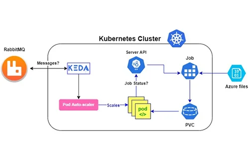

کوبرنتیز ([Kubernetes](https://kubernetes.io/)) یا به اختصار"K8s"، یک پلتفرم مدیریت کانتینری است که توسط Google توسعه داده شده است و اکنون تحت حمایت و پشتیبانی انواع شرکت‌ها و جوامع متن‌باز قرار دارد. Kubernetes برای اتوماسیون، اجرا، مدیریت و اسکالینگ برنامه‌های کانتینری مبتنی بر [Docker](https://www.hooshkar.com/Wiki/InformationTechnology/WhatIsDocker) (و سایر واسط‌های کانتینری) استفاده می‌شود.

کوبرنتیز (Kubernetes) با ارائه یک ساختار اصولی و انعطاف‌پذیر برای مدیریت برنامه‌ها درون کانتینرها، امکانات پیشرفته‌ای برای جریان کار، استقرار، تنظیم و مدیریت برنامه‌ها فراهم می‌کند. 

## برخی از ویژگی‌های اصلی Kubernetes عبارتند از:

**1. اتوماسیون:** به‌صورت خودکار انتقال، اجرا و مدیریت کانتینرها را انجام می‌دهد، به طوری که برنامه‌ها به‌طور خودکار به سرورهای موجود تخصیص داده و در صورت نیاز به سرورهای جدید مهاجرت می‌کنند.

**2. مقیاس‌پذیری:** امکان مقیاس‌پذیری برنامه‌ها را فراهم می‌کند، به طوری که برنامه‌ها می‌توانند به‌سادگی بر روی تعداد زیادی از سرورها اجرا شوند.

**3. مدیریت منابع:** استفاده کارآمد از منابع (پردازنده، حافظه و...) را با روشی یکپارچه فراهم می‌کند.

**4. دسترس پذیری بالا:** با ویزگی‌هایی مانند خود بهبودی و Failover بروزرسانی‌های چرخشی را ارائه می‌دهد.

**5. مانیتورینگ و لاگ:** خطایابی برنامه‌ها را آسانتر می‌کند.

**6.** و...

## کاربردهای Kubernetes در حوزه‌های مختلف عبارت است از:

* پیاده‌سازی و مدیریت آسان برنامه‌های کانتینر شده
* توسعه و ارائه برنامه‌های وب
* انتقال و اجرای برنامه‌ها در محیط‌های ابری
* انتقال و مدیریت برنامه‌ها در محیط‌های توزیع‌شده
* و...

